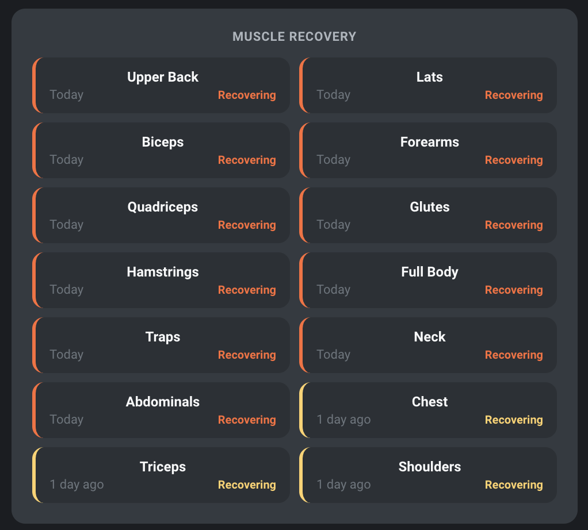

# Hevy Workout Tracker for Home Assistant

[](https://github.com/hacs/integration)
[](https://github.com/DisplacedForest/ha-hevy-tracker/releases)
[](https://github.com/DisplacedForest/ha-hevy-tracker/stargazers)
[](https://github.com/DisplacedForest/ha-hevy-tracker/commits/main)
[](LICENSE)
[](https://www.home-assistant.io/)

A comprehensive Home Assistant integration for tracking your [Hevy](https://www.hevyapp.com/) workouts — with rich set-level sensor data, personal records, muscle recovery tracking, and dashboard-ready cards.

> **Note:** A [Hevy Pro](https://www.hevyapp.com/pro) subscription is required to access the Hevy API.

---

## Installation

### Via HACS (Recommended)

[](https://my.home-assistant.io/redirect/hacs_repository/?owner=DisplacedForest&repository=ha-hevy-tracker&category=integration)

1. Click the button above, or search for **Hevy Workout Tracker** in HACS
2. Click **Download**
3. Restart Home Assistant

### Manual Installation

1. Download the `hevy` folder from the [latest release](https://github.com/DisplacedForest/ha-hevy-tracker/releases/latest)
2. Copy it to your `custom_components` directory
3. Restart Home Assistant

---

## Configuration

1. Go to **Settings** → **Devices & Services** → **+ Add Integration**
2. Search for **Hevy Workout Tracker**
3. Enter your Hevy API key

### Getting Your API Key

1. Open the Hevy app → **Profile** → **Settings** → **Developer**
2. Copy your API key

### Options

Access via **Devices & Services** → **Hevy Workout Tracker** → **Configure**

| Option | Default | Description |
|--------|---------|-------------|
| Polling Interval | 15 min | How often to fetch new data (5–120 min) |
| Unit System | Imperial | Display weights in lbs or kg |

---

## Features

- **Rich Workout Data** — Full set-level detail with weight, reps, and duration tracking
- **Summary Sensors** — Workout count, streaks, and weekly activity at a glance
- **Per-Exercise Sensors** — Individual sensors for each exercise with personal records
- **Muscle Group Tracking** — Which muscles you hit, which are due, days since last trained
- **Weekly Volume Analysis** — Volume per muscle group with full exercise breakdown
- **Routine Rotation** — Automatically detects the next workout in your A/B/C rotation
- **30-Day History** — Service call for full workout history with enriched data
- **Automatic Updates** — Configurable polling interval (5–120 minutes)
- **Unit Support** — Imperial (lbs) or metric (kg)

---

## Dashboard

The integration is designed to power a full workout dashboard. All examples below use [`custom:button-card`](https://github.com/custom-cards/button-card) and [`custom:layout-card`](https://github.com/thomasloven/lovelace-layout-card), both available in HACS.

<details>
<summary><b>Hero Stats Grid</b></summary>


```yaml
type: custom:layout-card
layout_type: custom:grid-layout
layout:
  grid-template-columns: 1fr 1fr
  grid-gap: 10px
  margin: 0
cards:
  # Streak
  - type: custom:button-card
    entity: sensor.hevy_workout_tracker_current_streak
    show_name: false
    show_state: false
    show_icon: false
    show_label: false
    tap_action:
      action: none
    custom_fields:
      stat: |
        [[[
          return '<div style="display:flex;align-items:center;justify-content:space-between;width:100%;">' +
            '<div style="color:#ADB5BD;font-size:11px;font-weight:600;text-transform:uppercase;letter-spacing:0.5px;">Streak</div>' +
            '<div style="display:flex;align-items:center;gap:8px;">' +
              '<span style="color:#F8F9FA;font-size:22px;font-weight:700;">' + (entity.state || '0') + '</span>' +
              '<ha-icon icon="mdi:fire" style="--mdc-icon-size:22px;color:#FF6B35;"></ha-icon>' +
            '</div>' +
          '</div>';
        ]]]
    styles:
      card:
        - background: "#343A40"
        - border-radius: 12px
        - padding: 16px
        - height: 56px
      grid:
        - grid-template-areas: '"stat"'
        - grid-template-columns: 1fr
      custom_fields:
        stat:
          - display: flex
          - align-items: center
          - width: 100%
  # This Week
  - type: custom:button-card
    entity: sensor.hevy_workout_tracker_weekly_workout_count
    show_name: false
    show_state: false
    show_icon: false
    show_label: false
    tap_action:
      action: none
    custom_fields:
      stat: |
        [[[
          return '<div style="display:flex;align-items:center;justify-content:space-between;width:100%;">' +
            '<div style="color:#ADB5BD;font-size:11px;font-weight:600;text-transform:uppercase;letter-spacing:0.5px;">This Week</div>' +
            '<div style="display:flex;align-items:center;gap:8px;">' +
              '<span style="color:#F8F9FA;font-size:22px;font-weight:700;">' + (entity.state || '0') + '</span>' +
              '<ha-icon icon="mdi:calendar-week" style="--mdc-icon-size:22px;color:#4ECDC4;"></ha-icon>' +
            '</div>' +
          '</div>';
        ]]]
    styles:
      card:
        - background: "#343A40"
        - border-radius: 12px
        - padding: 16px
        - height: 56px
      grid:
        - grid-template-areas: '"stat"'
        - grid-template-columns: 1fr
      custom_fields:
        stat:
          - display: flex
          - align-items: center
          - width: 100%
  # Total
  - type: custom:button-card
    entity: sensor.hevy_workout_tracker_workout_count
    show_name: false
    show_state: false
    show_icon: false
    show_label: false
    tap_action:
      action: none
    custom_fields:
      stat: |
        [[[
          return '<div style="display:flex;align-items:center;justify-content:space-between;width:100%;">' +
            '<div style="color:#ADB5BD;font-size:11px;font-weight:600;text-transform:uppercase;letter-spacing:0.5px;">Total</div>' +
            '<div style="display:flex;align-items:center;gap:8px;">' +
              '<span style="color:#F8F9FA;font-size:22px;font-weight:700;">' + (entity.state || '0') + '</span>' +
              '<ha-icon icon="mdi:counter" style="--mdc-icon-size:22px;color:#06D6A0;"></ha-icon>' +
            '</div>' +
          '</div>';
        ]]]
    styles:
      card:
        - background: "#343A40"
        - border-radius: 12px
        - padding: 16px
        - height: 56px
      grid:
        - grid-template-areas: '"stat"'
        - grid-template-columns: 1fr
      custom_fields:
        stat:
          - display: flex
          - align-items: center
          - width: 100%
  # Today
  - type: custom:button-card
    entity: sensor.hevy_workout_tracker_worked_out_today
    show_name: false
    show_state: false
    show_icon: false
    show_label: false
    tap_action:
      action: none
    custom_fields:
      stat: |
        [[[
          var done = entity.state == 'on';
          var iconColor = done ? '#51CF66' : '#495057';
          var label = done ? 'Done' : 'Not yet';
          return '<div style="display:flex;align-items:center;justify-content:space-between;width:100%;">' +
            '<div style="color:#ADB5BD;font-size:11px;font-weight:600;text-transform:uppercase;letter-spacing:0.5px;">Today</div>' +
            '<div style="display:flex;align-items:center;gap:8px;">' +
              '<span style="color:#F8F9FA;font-size:22px;font-weight:700;">' + label + '</span>' +
              '<ha-icon icon="mdi:check-circle" style="--mdc-icon-size:22px;color:' + iconColor + ';"></ha-icon>' +
            '</div>' +
          '</div>';
        ]]]
    styles:
      card:
        - background: "#343A40"
        - border-radius: 12px
        - padding: 16px
        - height: 56px
      grid:
        - grid-template-areas: '"stat"'
        - grid-template-columns: 1fr
      custom_fields:
        stat:
          - display: flex
          - align-items: center
          - width: 100%
```

</details>

<details>
<summary><b>Last Workout Card</b></summary>


```yaml
type: custom:button-card
entity: sensor.hevy_workout_tracker_last_workout_summary
show_name: false
show_state: false
show_icon: false
show_label: false
tap_action:
  action: none
custom_fields:
  content: |
    [[[
      var title = entity.state || 'No workouts';
      var dateStr = entity.attributes.date;
      var mins = entity.attributes.duration_minutes;
      var vol = entity.attributes.total_volume;
      var unit = entity.attributes.total_volume_unit || 'lbs';
      var timeAgo = '';
      if (dateStr) {
        var date = new Date(dateStr);
        var now = new Date();
        var diff = Math.floor((now - date) / 1000);
        if (diff < 60) timeAgo = 'Just now';
        else if (diff < 3600) { var m = Math.floor(diff / 60); timeAgo = m + (m === 1 ? ' min ago' : ' mins ago'); }
        else if (diff < 86400) { var h = Math.floor(diff / 3600); timeAgo = h + (h === 1 ? ' hr ago' : ' hrs ago'); }
        else if (diff < 172800) timeAgo = 'Yesterday';
        else { var d = Math.floor(diff / 86400); timeAgo = d + 'd ago'; }
      }
      var meta = timeAgo + (mins ? ' · ' + mins + ' min' : '');
      var volStr = vol ? Math.round(vol).toLocaleString() + ' ' + unit : '';

      var muscleEntity = states['sensor.hevy_workout_tracker_muscle_group_summary'];
      var groups = (muscleEntity && muscleEntity.attributes) ? muscleEntity.attributes.last_workout_primary_groups || [] : [];
      var pills = '';
      groups.forEach(function(g) {
        var name = g.split('_').map(function(w){ return w.charAt(0).toUpperCase() + w.slice(1); }).join(' ');
        pills += '<span style="display:inline-block;background:rgba(78,205,196,0.1);border:1px solid rgba(78,205,196,0.2);border-radius:20px;padding:2px 10px;margin:2px 4px 2px 0;font-size:11px;color:#4ECDC4;font-weight:500;">' + name + '</span>';
      });

      return '<div>' +
        '<div style="display:flex;align-items:flex-start;justify-content:space-between;margin-bottom:12px;">' +
          '<div style="color:#ADB5BD;font-size:11px;font-weight:600;text-transform:uppercase;letter-spacing:0.5px;">LAST WORKOUT</div>' +
        '</div>' +
        '<div style="color:#F8F9FA;font-size:26px;font-weight:700;margin-bottom:8px;">' + title + '</div>' +
        '<div style="color:#ADB5BD;font-size:13px;margin-bottom:10px;">' + meta + '</div>' +
        (volStr ? '<div style="color:#4ECDC4;font-size:20px;font-weight:700;margin-bottom:12px;">' + volStr + '</div>' : '') +
        (pills ? '<div style="line-height:2;">' + pills + '</div>' : '') +
      '</div>';
    ]]]
styles:
  card:
    - background: "#343A40"
    - border-radius: 12px
    - padding: 20px
    - margin-top: 8px
  grid:
    - grid-template-areas: '"content"'
    - grid-template-columns: 1fr
  custom_fields:
    content:
      - white-space: normal
```

</details>

<details>
<summary><b>Weekly Volume Bar Chart</b></summary>


```yaml
type: custom:button-card
entity: sensor.hevy_workout_tracker_weekly_muscle_volume
show_name: false
show_state: false
show_icon: false
show_label: false
tap_action:
  action: none
custom_fields:
  vol: |
    [[[
      return (function() {
        var groups = entity.attributes.muscle_groups || {};
        var totalVol = parseFloat(entity.state) || 0;
        var totalSets = entity.attributes.total_sets || 0;
        var totalWorkouts = entity.attributes.total_workouts || 0;
        var fmt = function(n) { return n.split('_').map(function(w){ return w.charAt(0).toUpperCase() + w.slice(1); }).join(' '); };
        var h = '<div>';
        h += '<div style="display:flex;align-items:center;justify-content:space-between;margin-bottom:4px;">';
        h += '<div style="color:#ADB5BD;font-size:11px;font-weight:600;text-transform:uppercase;letter-spacing:0.5px;">Weekly Volume</div>';
        h += '<div style="color:#6C757D;font-size:11px;">' + totalWorkouts + ' workouts · ' + totalSets + ' sets</div>';
        h += '</div>';
        h += '<div style="color:#4ECDC4;font-size:18px;font-weight:700;margin-bottom:14px;">' + Math.round(totalVol).toLocaleString() + ' lbs</div>';
        var sorted = Object.entries(groups).sort(function(a,b) { return b[1] - a[1]; });
        if (!sorted.length) {
          h += '<div style="color:#6C757D;font-size:13px;">No data this week</div>';
          h += '</div>';
          return h;
        }
        var maxVol = sorted[0][1];
        sorted.forEach(function(pair) {
          var name = pair[0]; var vl = pair[1];
          var pct = maxVol > 0 ? (vl / maxVol * 100) : 0;
          var label = fmt(name);
          h += '<div style="display:flex;align-items:center;margin-bottom:8px;gap:8px;">';
          h += '<div style="width:72px;flex-shrink:0;color:#ADB5BD;font-size:12px;text-align:right;">' + label + '</div>';
          h += '<div style="flex:1;height:16px;background:#2B3035;border-radius:3px;overflow:hidden;">';
          h += '<div style="width:' + pct + '%;height:100%;background:linear-gradient(90deg,#4ECDC4,#45B7AA);border-radius:3px;"></div>';
          h += '</div>';
          h += '<div style="width:48px;flex-shrink:0;color:#F8F9FA;font-size:12px;text-align:right;">' + Math.round(vl).toLocaleString() + '</div>';
          h += '</div>';
        });
        h += '</div>';
        return h;
      })();
    ]]]
styles:
  card:
    - background: "#343A40"
    - border-radius: 12px
    - padding: 18px
    - margin-top: 8px
  grid:
    - grid-template-areas: '"vol"'
    - grid-template-columns: 1fr
  custom_fields:
    vol:
      - white-space: normal
```

</details>

<details>
<summary><b>Muscle Recovery Grid</b></summary>



```yaml
type: custom:button-card
entity: sensor.hevy_workout_tracker_muscle_group_summary
show_name: false
show_state: false
show_icon: false
show_label: false
tap_action:
  action: none
custom_fields:
  rec: |
    [[[
      return (function() {
        var daysSince = entity.attributes.days_since_last || {};
        var musclesDue = entity.attributes.muscles_due || [];
        var dueSet = {};
        musclesDue.forEach(function(m) { dueSet[m] = true; });
        var fmt = function(n) { return n.split('_').map(function(w){ return w.charAt(0).toUpperCase() + w.slice(1); }).join(' '); };
        var h = '<div>';
        h += '<div style="color:#ADB5BD;font-size:11px;font-weight:600;text-transform:uppercase;letter-spacing:0.5px;margin-bottom:12px;">Muscle Recovery</div>';
        var sorted = Object.entries(daysSince).sort(function(a,b) { return a[1] - b[1]; });
        if (!sorted.length) {
          h += '<div style="color:#6C757D;font-size:13px;">No data yet</div></div>';
          return h;
        }
        h += '<div style="display:grid;grid-template-columns:1fr 1fr;gap:8px;">';
        sorted.forEach(function(pair) {
          var name = pair[0]; var days = pair[1];
          var color, label;
          if (days === 0) { color = '#FF6B35'; label = 'Recovering'; }
          else if (days === 1) { color = '#FFD166'; label = 'Recovering'; }
          else if (days <= 3) { color = '#06D6A0'; label = 'Ready'; }
          else if (days <= 5) { color = '#4ECDC4'; label = 'Train Soon'; }
          else { color = '#ADB5BD'; label = 'Overdue'; }
          var displayName = fmt(name);
          var timeLabel = days === 0 ? 'Today' : days === 1 ? '1 day ago' : days + ' days ago';
          var isDue = dueSet[name] === true;
          var glow = isDue ? 'box-shadow:0 0 8px ' + color + '33;' : '';
          h += '<div style="background:#2B3035;border-radius:10px;padding:10px 12px;border-left:3px solid ' + color + ';' + glow + '">';
          h += '<div style="color:#F8F9FA;font-size:12px;font-weight:600;margin-bottom:2px;">' + displayName + '</div>';
          h += '<div style="display:flex;justify-content:space-between;align-items:center;">';
          h += '<span style="color:#6C757D;font-size:11px;">' + timeLabel + '</span>';
          h += '<span style="color:' + color + ';font-size:10px;font-weight:600;">' + label + '</span>';
          h += '</div></div>';
        });
        h += '</div></div>';
        return h;
      })();
    ]]]
styles:
  card:
    - background: "#343A40"
    - border-radius: 12px
    - padding: 18px
    - margin-top: 8px
  grid:
    - grid-template-areas: '"rec"'
    - grid-template-columns: 1fr
  custom_fields:
    rec:
      - white-space: normal
```

</details>

<details>
<summary><b>Personal Records Grid</b></summary>


```yaml
type: custom:button-card
entity: sensor.hevy_workout_tracker_workout_count
show_name: false
show_state: false
show_icon: false
show_label: false
tap_action:
  action: none
custom_fields:
  prs: |
    [[[
      return (function() {
        var exercises = Object.keys(states).filter(function(e) {
          return e.startsWith('sensor.hevy_workout_tracker_') &&
                 states[e].attributes.personal_record_weight !== undefined;
        });
        var fmt = function(n) { return n.split('_').map(function(w){ return w.charAt(0).toUpperCase() + w.slice(1); }).join(' '); };
        var h = '<div>';
        h += '<div style="color:#ADB5BD;font-size:11px;font-weight:600;text-transform:uppercase;letter-spacing:0.5px;margin-bottom:12px;">Personal Records</div>';
        if (!exercises.length) {
          h += '<div style="color:#6C757D;font-size:13px;">No PR data yet</div></div>';
          return h;
        }
        h += '<div style="display:grid;grid-template-columns:1fr 1fr;gap:8px;">';
        exercises.sort(function(a, b) {
          var ga = (states[a].attributes.muscle_group || 'zzz');
          var gb = (states[b].attributes.muscle_group || 'zzz');
          return ga.localeCompare(gb);
        });
        exercises.forEach(function(eid) {
          var s = states[eid];
          var name = s.attributes.friendly_name || eid;
          name = name.replace('Hevy Workout Tracker ', '');
          var prW = s.attributes.personal_record_weight;
          var prR = s.attributes.personal_record_reps;
          var unit = s.attributes.weight_unit || 'lbs';
          var group = s.attributes.muscle_group || '';
          var groupLabel = group ? fmt(group) : '';
          var prStr = '';
          if (prW != null && prR != null) prStr = prW + ' ' + unit + ' x ' + prR;
          else if (prW != null) prStr = prW + ' ' + unit;
          else return;
          h += '<div style="background:#2B3035;border-radius:10px;padding:10px 12px;text-align:center;">';
          h += '<div style="color:#F8F9FA;font-size:12px;font-weight:600;margin-bottom:2px;">' + name + '</div>';
          h += '<div style="color:#4ECDC4;font-size:13px;font-weight:700;margin-bottom:2px;">' + prStr + '</div>';
          if (groupLabel) h += '<div style="color:#6C757D;font-size:10px;">' + groupLabel + '</div>';
          h += '</div>';
        });
        h += '</div></div>';
        return h;
      })();
    ]]]
styles:
  card:
    - background: "#343A40"
    - border-radius: 12px
    - padding: 18px
    - margin-top: 8px
  grid:
    - grid-template-areas: '"prs"'
    - grid-template-columns: 1fr
  custom_fields:
    prs:
      - white-space: normal
```

</details>

<details>
<summary><b>30-Day Activity Calendar</b></summary>

```yaml
type: custom:button-card
entity: sensor.hevy_workout_tracker_last_workout_date
show_name: false
show_state: false
show_icon: false
show_label: false
tap_action:
  action: none
custom_fields:
  cal: |
    [[[
      return (function() {
        var workoutDates = entity.attributes.workout_dates || [];
        var wdSet = {};
        workoutDates.forEach(function(d) { wdSet[d] = true; });
        var today = new Date();
        today.setHours(0,0,0,0);
        var pad = function(n) { return n < 10 ? '0' + n : '' + n; };
        var todayStr = today.getFullYear() + '-' + pad(today.getMonth()+1) + '-' + pad(today.getDate());
        var startDate = new Date(today);
        startDate.setDate(today.getDate() - 29);
        var dayNames = ['S','M','T','W','T','F','S'];
        var h = '<div>';
        h += '<div style="color:#ADB5BD;font-size:11px;font-weight:600;text-transform:uppercase;letter-spacing:0.5px;margin-bottom:12px;">Last 30 Days</div>';
        h += '<div style="display:grid;grid-template-columns:repeat(7,1fr);gap:5px;">';
        for (var di = 0; di < 7; di++) {
          h += '<div style="text-align:center;color:#6C757D;font-size:10px;font-weight:600;padding:2px 0;">' + dayNames[di] + '</div>';
        }
        var firstDow = startDate.getDay();
        for (var j = 0; j < firstDow; j++) { h += '<div></div>'; }
        for (var i = 0; i < 30; i++) {
          var dd = new Date(startDate);
          dd.setDate(startDate.getDate() + i);
          var dStr = dd.getFullYear() + '-' + pad(dd.getMonth()+1) + '-' + pad(dd.getDate());
          var isToday = dStr === todayStr;
          var isWorkout = wdSet[dStr] === true;
          var dayNum = dd.getDate();
          var bg = '#2B3035'; var clr = '#6C757D'; var fw = '400'; var bdr = 'none'; var shd = 'none';
          if (isWorkout && isToday) { bg = '#4ECDC4'; clr = '#1A1D20'; fw = '700'; shd = '0 0 8px rgba(78,205,196,0.4)'; }
          else if (isWorkout) { bg = '#4ECDC4'; clr = '#1A1D20'; fw = '700'; }
          else if (isToday) { bg = '#2B3035'; clr = '#F8F9FA'; fw = '500'; bdr = '2px solid #4ECDC4'; }
          h += '<div style="text-align:center;padding:6px 0;border-radius:8px;font-size:12px;background:' + bg + ';color:' + clr + ';font-weight:' + fw + ';border:' + bdr + ';box-shadow:' + shd + ';">' + dayNum + '</div>';
        }
        h += '</div></div>';
        return h;
      })();
    ]]]
styles:
  grid:
    - grid-template-areas: '"cal"'
    - grid-template-columns: 1fr
  card:
    - background: "#343A40"
    - border-radius: 12px
    - padding: 18px
    - margin-top: 8px
  custom_fields:
    cal:
      - white-space: normal
```

</details>

---

## Sensors

### Summary Sensors

| Sensor | Description | State |
|--------|-------------|-------|
| `sensor.hevy_workout_count` | Total lifetime workouts | Integer |
| `sensor.hevy_last_workout_date` | Timestamp of most recent workout | ISO datetime |
| `sensor.hevy_last_workout_summary` | Full summary of last workout | Workout title |
| `sensor.hevy_weekly_workout_count` | Workouts completed in last 7 days | Integer |
| `sensor.hevy_current_streak` | Consecutive workout days (1 rest day allowed) | Days |
| `sensor.hevy_muscle_group_summary` | Muscle groups trained in last workout | Comma-separated |
| `sensor.hevy_weekly_muscle_volume` | Total weekly volume across all groups | Volume (lbs or kg) |
| `sensor.hevy_next_workout` | Next routine in your A/B/C rotation | Routine title |

### Binary Sensors

| Sensor | Description |
|--------|-------------|
| `binary_sensor.hevy_worked_out_today` | `on` if a workout was logged today |
| `binary_sensor.hevy_worked_out_this_week` | `on` if any workout in last 7 days |

### Per-Exercise Sensors

Dynamically created for each unique exercise in your history.

**Example:** `sensor.hevy_bench_press_dumbbell`
**State:** Best set — e.g., `35 lbs × 12` or `60s`

| Attribute | Description |
|-----------|-------------|
| `last_workout_date` | ISO datetime of last time this exercise was performed |
| `last_workout_sets` | List of all sets from last workout |
| `weight` | Most recent weight used |
| `weight_unit` | Unit system (lbs or kg) |
| `total_reps` | Total reps from last workout |
| `total_sets` | Number of sets performed |
| `personal_record_weight` | Heaviest weight ever used |
| `personal_record_reps` | Most reps at PR weight |
| `exercise_template_id` | Hevy exercise ID |

---

## Services

### `hevy.get_workout_history`

Returns enriched workout history for a specified number of days. Call via **Developer Tools → Services**.

| Parameter | Required | Default | Description |
|-----------|----------|---------|-------------|
| `config_entry_id` | Yes | — | The Hevy integration config entry ID |
| `days` | No | 30 | Number of days of history (1–90) |

**Response includes:**
- `summary` — Total workouts, total volume, workout days, avg duration, avg volume per workout
- `workouts` — Array of workouts with full exercise/set detail, muscle groups, and duration

<details>
<summary><b>Example automation using service response</b></summary>

```yaml
action:
  - service: hevy.get_workout_history
    data:
      config_entry_id: !input config_entry
      days: 7
    response_variable: history
  - service: notify.mobile_app
    data:
      message: "This week: {{ history.summary.total_workouts }} workouts, {{ history.summary.total_volume }} lbs total volume"
```

</details>

---

## Automation Examples

<details>
<summary><b>Workout streak milestone</b></summary>

```yaml
automation:
  - alias: "Workout Streak Milestone"
    trigger:
      - platform: numeric_state
        entity_id: sensor.hevy_current_streak
        above: 7
    action:
      - service: notify.mobile_app
        data:
          message: "7 day workout streak! Keep it up!"
```

</details>

<details>
<summary><b>Rest day reminder</b></summary>

```yaml
automation:
  - alias: "Rest Day Reminder"
    trigger:
      - platform: time
        at: "18:00:00"
    condition:
      - condition: state
        entity_id: binary_sensor.hevy_worked_out_today
        state: "off"
      - condition: numeric_state
        entity_id: sensor.hevy_current_streak
        above: 0
    action:
      - service: notify.mobile_app
        data:
          message: "Don't break your streak! Time for a workout."
```

</details>

<details>
<summary><b>Personal record alert</b></summary>

```yaml
automation:
  - alias: "New PR Notification"
    trigger:
      - platform: state
        entity_id: sensor.hevy_bench_press_dumbbell
        attribute: personal_record_weight
    condition:
      - condition: template
        value_template: "{{ trigger.to_state.attributes.personal_record_weight > trigger.from_state.attributes.personal_record_weight }}"
    action:
      - service: notify.mobile_app
        data:
          message: "New PR on Bench Press: {{ trigger.to_state.attributes.personal_record_weight }} {{ trigger.to_state.attributes.weight_unit }}!"
```

</details>

---

## Sensor Attribute Reference

<details>
<summary><b>Muscle Group Summary attributes</b></summary>

```yaml
last_workout_primary_groups:
  - chest
  - shoulders
  - quadriceps
  - biceps
last_workout_secondary_groups:
  - triceps
  - glutes
  - hamstrings
last_workout_date: "2026-02-11T16:21:10+00:00"
days_since_last:
  chest: 0
  shoulders: 0
  quadriceps: 0
  lats: 2
  hamstrings: 4
muscles_due:
  - hamstrings
  - glutes
```

</details>

<details>
<summary><b>Weekly Muscle Volume attributes</b></summary>

```yaml
period_start: "2026-02-04T16:00:00"
period_end: "2026-02-11T16:00:00"
muscle_groups:
  chest: 1860.0
  shoulders: 960.0
  quadriceps: 2025.0
exercise_breakdown:
  chest:
    - exercise: "Bench Press (Dumbbell)"
      volume: 1860.0
      sets: 3
  shoulders:
    - exercise: "Overhead Press (Dumbbell)"
      volume: 960.0
      sets: 3
total_sets: 45
total_workouts: 5
```

</details>

<details>
<summary><b>Next Workout attributes</b></summary>

```yaml
routine_id: "uuid-of-next-routine"
routine_title: "Day B - Pull/Hinge Focus"
last_workout_title: "Day A - Push/Quad Focus"
last_workout_routine_id: "uuid-of-last-routine"
rotation_position: 2
rotation_total: 3
exercises_preview:
  - "Barbell Row"
  - "Romanian Deadlift"
  - "Pull-up"
  - "Face Pull"
```

</details>

<details>
<summary><b>Last Workout Date — <code>workout_summaries</code> attribute</b></summary>

The `workout_summaries` attribute on `sensor.hevy_last_workout_date` provides a date-keyed dict of the last 30 days of workouts, useful for powering calendar cards.

```yaml
workout_summaries:
  "2026-02-10":
    title: "Push Day"
    duration_minutes: 62.5
    total_volume: 12450
    total_volume_unit: "lbs"
    exercise_count: 5
    exercises:
      - name: "Bench Press (Barbell)"
        sets:
          - type: "normal"
            weight: 185.0
            weight_unit: "lbs"
            reps: 5
        best_set: "185.0 lbs × 5"
        total_reps: 25
        notes: null
```

If multiple workouts fall on the same date, only the most recent is included.

</details>

---

## Troubleshooting

**Integration not showing up after install**
- Restart Home Assistant after installation
- Check logs: **Settings → System → Logs**

**Invalid API key error**
- Verify your key in the Hevy app under **Settings → Developer**
- Try regenerating the key

**Sensors not updating**
- Check your polling interval in the integration options
- Review HA logs for API errors

**Missing exercise sensors**
- Sensors are created dynamically on first data fetch
- Wait one polling cycle after logging a new exercise type

---

## Support

- [Open an issue](https://github.com/DisplacedForest/ha-hevy-tracker/issues) for bug reports or feature requests
- [Home Assistant Community](https://community.home-assistant.io/) for general discussion

---

## License

MIT — see [LICENSE](LICENSE) for details.
