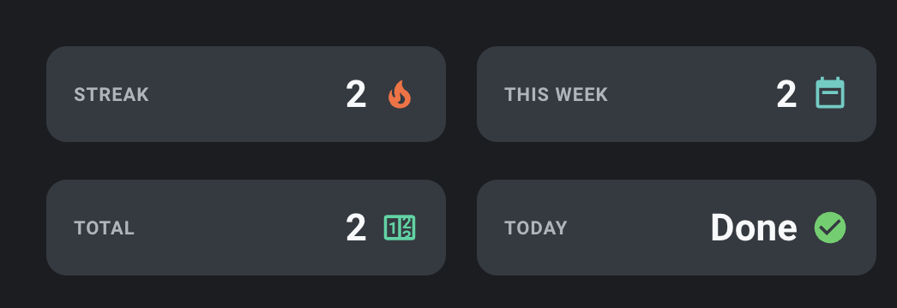
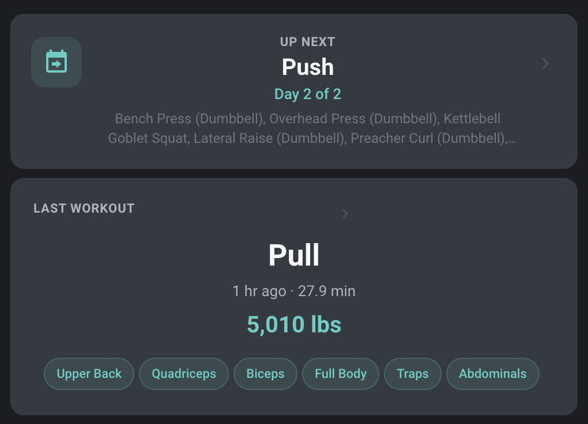
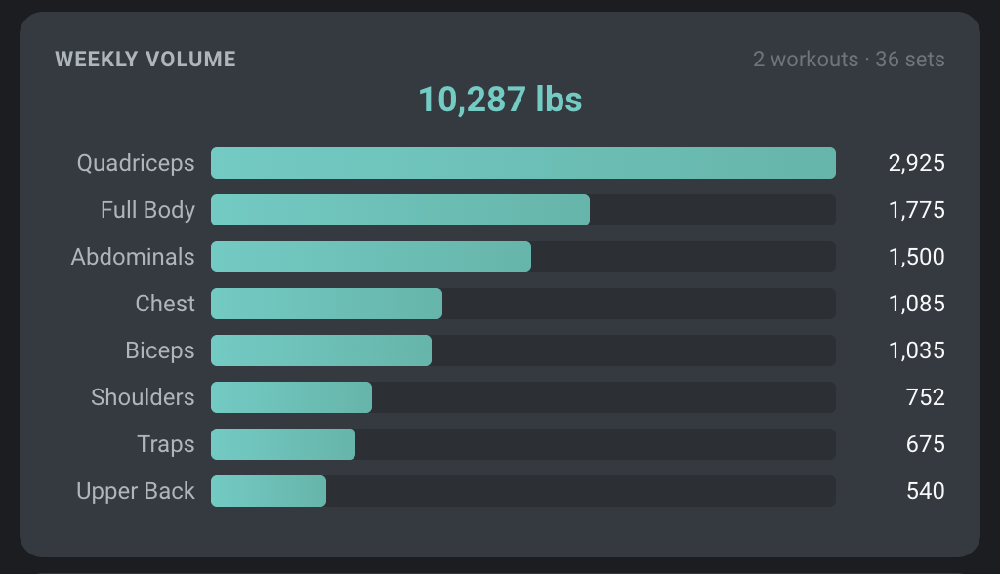

# Hevy Workout Tracker for Home Assistant

[](https://github.com/custom-components/hacs)

A comprehensive Home Assistant integration for tracking your Hevy workouts with rich, detailed sensor data.

## Features

- **Rich Workout Data** - Full set-level detail with weight, reps, and duration tracking
- **Summary Sensors** - Workout count, streaks, weekly activity
- **Per-Exercise Tracking** - Individual sensors for each exercise with personal records
- **Muscle Group Tracking** - Which muscles you hit, which are due, days since last trained
- **Weekly Volume Analysis** - Volume per muscle group with exercise breakdown
- **Routine Rotation** - Automatically detects next workout in your A/B/C rotation
- **Smart Metrics** - Total volume, best sets, and workout duration
- **30-Day History** - Service call for full workout history with enriched data
- **Automatic Updates** - Configurable polling interval (5-120 minutes)
- **Unit Support** - Display in imperial (lbs) or metric (kg)

## Installation

### HACS (Recommended)

1. Open HACS in Home Assistant
2. Click the three dots in the top right corner
3. Select "Custom repositories"
4. Add this repository URL with category "Integration"
5. Click "Install"
6. Restart Home Assistant

### Manual Installation

1. Download the `hevy` folder from this repository
2. Copy it to your `custom_components` directory
3. Restart Home Assistant

## Configuration

1. Go to **Settings** → **Devices & Services**
2. Click **+ Add Integration**
3. Search for **Hevy Workout Tracker**
4. Enter your Hevy API key

### Getting Your API Key

> **Note:** A Hevy Pro subscription is required to access the API.

1. Log in to your Hevy account
2. Go to **Settings** → **Developer**
3. Copy your API key

## Sensors

### Summary Sensors

| Sensor | Description | State |
|--------|-------------|-------|
| `sensor.hevy_workout_count` | Total lifetime workouts | Integer count |
| `sensor.hevy_last_workout_date` | Timestamp of most recent workout; includes `workout_dates` list and `workout_summaries` dict for 30-day history | ISO datetime |
| `sensor.hevy_last_workout_summary` | Full summary of last workout | Workout title |
| `sensor.hevy_weekly_workout_count` | Workouts in last 7 days | Integer count |
| `sensor.hevy_current_streak` | Consecutive workout days | Days (allows 1 rest day) |
| `sensor.hevy_muscle_group_summary` | Muscle groups from last workout | Comma-separated groups |
| `sensor.hevy_weekly_muscle_volume` | Total weekly volume across all groups | Volume (lbs or kg) |
| `sensor.hevy_next_workout` | Next routine in rotation | Routine title |

### Binary Sensors

| Sensor | Description |
|--------|-------------|
| `binary_sensor.hevy_worked_out_today` | On if workout logged today |
| `binary_sensor.hevy_worked_out_this_week` | On if any workout in last 7 days |

### Per-Exercise Sensors

Dynamically created for each unique exercise:

**Example:** `sensor.hevy_bench_press_dumbbell`

**State:** Best set (e.g., "35 lbs × 12" or "60s")

**Attributes:**
- `last_workout_date` - ISO datetime of last workout
- `last_workout_sets` - List of all sets from last workout
- `weight` - Most recent weight used
- `weight_unit` - Unit system (lbs or kg)
- `total_reps` - Total reps from last workout
- `total_sets` - Number of sets performed
- `personal_record_weight` - Heaviest weight ever used
- `personal_record_reps` - Most reps at PR weight
- `exercise_template_id` - Hevy exercise ID

## Detailed Sensor Attributes

### Muscle Group Summary Attributes

```yaml
last_workout_primary_groups:
  - chest
  - shoulders
  - quadriceps
  - biceps
last_workout_secondary_groups:
  - triceps
  - glutes
  - hamstrings
last_workout_date: "2026-02-11T16:21:10+00:00"
days_since_last:
  chest: 0
  shoulders: 0
  quadriceps: 0
  lats: 2
  hamstrings: 4
muscles_due:
  - hamstrings
  - glutes
```

### Weekly Muscle Volume Attributes

```yaml
period_start: "2026-02-04T16:00:00"
period_end: "2026-02-11T16:00:00"
muscle_groups:
  chest: 1860.0
  shoulders: 960.0
  quadriceps: 2025.0
exercise_breakdown:
  chest:
    - exercise: "Bench Press (Dumbbell)"
      volume: 1860.0
      sets: 3
  shoulders:
    - exercise: "Overhead Press (Dumbbell)"
      volume: 960.0
      sets: 3
total_sets: 45
total_workouts: 5
```

### Next Workout Attributes

```yaml
routine_id: "uuid-of-next-routine"
routine_title: "Day B - Pull/Hinge Focus"
last_workout_title: "Day A - Push/Quad Focus"
last_workout_routine_id: "uuid-of-last-routine"
rotation_position: 2
rotation_total: 3
exercises_preview:
  - "Barbell Row"
  - "Romanian Deadlift"
  - "Pull-up"
  - "Face Pull"
```

### Last Workout Date — `workout_summaries` Attribute

The `workout_summaries` attribute on `sensor.hevy_last_workout_date` provides a date-keyed dict of workout details for the 30-day window. This enables dashboard cards (e.g., the 30-day calendar) to show per-day workout info when a date is tapped.

```yaml
workout_summaries:
  "2026-02-10":
    title: "Push Day"
    duration_minutes: 62.5
    total_volume: 12450
    total_volume_unit: "lbs"
    exercise_count: 5
    exercises:
      - name: "Bench Press (Barbell)"
        sets:
          - type: "normal"
            weight: 185.0
            weight_unit: "lbs"
            reps: 5
        best_set: "185.0 lbs × 5"
        total_reps: 25
        notes: null
  "2026-02-08":
    title: "Pull Day"
    duration_minutes: 55.2
    total_volume: 9800
    total_volume_unit: "lbs"
    exercise_count: 4
    exercises:
      - name: "Barbell Row"
        sets:
          - type: "normal"
            weight: 135.0
            weight_unit: "lbs"
            reps: 8
        best_set: "135.0 lbs × 8"
        total_reps: 32
        notes: null
```

If multiple workouts fall on the same date, only the most recent one is included.

### Last Workout Summary Attributes

```yaml
date: "2026-02-11T16:21:10+00:00"
duration_minutes: 4.7
total_volume: 1158.5
total_volume_unit: "lbs"
exercise_count: 2
exercises:
  - name: "Bench Press (Dumbbell)"
    sets:
      - type: "normal"
        weight: 35.0
        weight_unit: "lbs"
        reps: 12
        duration_seconds: null
      - type: "normal"
        weight: 35.0
        weight_unit: "lbs"
        reps: 12
        duration_seconds: null
    best_set: "35 lbs × 12"
    total_reps: 24
  - name: "Plank"
    sets:
      - type: "normal"
        weight: null
        weight_unit: "lbs"
        reps: null
        duration_seconds: 60
    best_set: "1m 00s"
    total_duration_seconds: 60
```

## Services

### `hevy.get_workout_history`

Returns enriched workout history for a specified number of days. Call via **Developer Tools > Services**.

| Parameter | Required | Default | Description |
|-----------|----------|---------|-------------|
| `config_entry_id` | Yes | - | The Hevy integration config entry ID |
| `days` | No | 30 | Number of days of history (1-90) |

**Response includes:**
- `summary` - Total workouts, total volume, workout days, avg duration, avg volume per workout
- `workouts` - Array of workouts with full exercise/set detail, muscle groups, and duration

**Example automation using service response:**
```yaml
action:
  - service: hevy.get_workout_history
    data:
      config_entry_id: !input config_entry
      days: 7
    response_variable: history
  - service: notify.mobile_app
    data:
      message: "This week: {{ history.summary.total_workouts }} workouts, {{ history.summary.total_volume }} lbs total volume"
```

## Configuration Options

Access via **Devices & Services** → **Hevy Workout Tracker** → **Configure**

- **Polling Interval** - How often to fetch new data (5-120 minutes, default: 15)
- **Unit System** - Display units (imperial/metric, default: imperial)

## Weight Conversion

- All weights displayed in lbs (converted from kg)
- Rounded to nearest 0.5 lbs for readability
- Conversion factor: 1 kg = 2.20462 lbs

## API Details

This integration uses the official Hevy API:
- Base URL: `https://api.hevyapp.com/v1/`
- Authentication: API key header
- Rate limiting: Respects polling interval

## Use Cases

### Automation Examples

**Workout Streak Notification:**
```yaml
automation:
  - alias: "Workout Streak Milestone"
    trigger:
      - platform: numeric_state
        entity_id: sensor.hevy_current_streak
        above: 7
    action:
      - service: notify.mobile_app
        data:
          message: "7 day workout streak! Keep it up!"
```

**Rest Day Reminder:**
```yaml
automation:
  - alias: "Rest Day Reminder"
    trigger:
      - platform: time
        at: "18:00:00"
    condition:
      - condition: state
        entity_id: binary_sensor.hevy_worked_out_today
        state: "off"
      - condition: numeric_state
        entity_id: sensor.hevy_current_streak
        above: 0
    action:
      - service: notify.mobile_app
        data:
          message: "Don't break your streak! Time for a workout."
```

**Personal Record Alert:**
```yaml
automation:
  - alias: "New PR Notification"
    trigger:
      - platform: state
        entity_id: sensor.hevy_bench_press_dumbbell
        attribute: personal_record_weight
    condition:
      - condition: template
        value_template: "{{ trigger.to_state.attributes.personal_record_weight > trigger.from_state.attributes.personal_record_weight }}"
    action:
      - service: notify.mobile_app
        data:
          message: "New PR on Bench Press: {{ trigger.to_state.attributes.personal_record_weight }} {{ trigger.to_state.attributes.weight_unit }}!"
```

### Dashboard Examples

The following examples use [`custom:button-card`](https://github.com/custom-cards/button-card) and [`custom:layout-card`](https://github.com/thomasloven/lovelace-layout-card), both installable via HACS.

#### Hero Stats Grid



```yaml
type: custom:layout-card
layout_type: custom:grid-layout
layout:
  grid-template-columns: 1fr 1fr
  grid-gap: 10px
  margin: 0
cards:
  # Streak
  - type: custom:button-card
    entity: sensor.hevy_workout_tracker_current_streak
    show_name: false
    show_state: false
    show_icon: false
    show_label: false
    tap_action:
      action: none
    custom_fields:
      stat: |
        [[[
          return '<div style="display:flex;align-items:center;justify-content:space-between;width:100%;">' +
            '<div style="color:#ADB5BD;font-size:11px;font-weight:600;text-transform:uppercase;letter-spacing:0.5px;">Streak</div>' +
            '<div style="display:flex;align-items:center;gap:8px;">' +
              '<span style="color:#F8F9FA;font-size:22px;font-weight:700;">' + (entity.state || '0') + '</span>' +
              '<ha-icon icon="mdi:fire" style="--mdc-icon-size:22px;color:#FF6B35;"></ha-icon>' +
            '</div>' +
          '</div>';
        ]]]
    styles:
      card:
        - background: "#343A40"
        - border-radius: 12px
        - padding: 16px
        - height: 56px
      grid:
        - grid-template-areas: '"stat"'
        - grid-template-columns: 1fr
      custom_fields:
        stat:
          - display: flex
          - align-items: center
          - width: 100%
  # This Week
  - type: custom:button-card
    entity: sensor.hevy_workout_tracker_weekly_workout_count
    show_name: false
    show_state: false
    show_icon: false
    show_label: false
    tap_action:
      action: none
    custom_fields:
      stat: |
        [[[
          return '<div style="display:flex;align-items:center;justify-content:space-between;width:100%;">' +
            '<div style="color:#ADB5BD;font-size:11px;font-weight:600;text-transform:uppercase;letter-spacing:0.5px;">This Week</div>' +
            '<div style="display:flex;align-items:center;gap:8px;">' +
              '<span style="color:#F8F9FA;font-size:22px;font-weight:700;">' + (entity.state || '0') + '</span>' +
              '<ha-icon icon="mdi:calendar-week" style="--mdc-icon-size:22px;color:#4ECDC4;"></ha-icon>' +
            '</div>' +
          '</div>';
        ]]]
    styles:
      card:
        - background: "#343A40"
        - border-radius: 12px
        - padding: 16px
        - height: 56px
      grid:
        - grid-template-areas: '"stat"'
        - grid-template-columns: 1fr
      custom_fields:
        stat:
          - display: flex
          - align-items: center
          - width: 100%
  # Total
  - type: custom:button-card
    entity: sensor.hevy_workout_tracker_workout_count
    show_name: false
    show_state: false
    show_icon: false
    show_label: false
    tap_action:
      action: none
    custom_fields:
      stat: |
        [[[
          return '<div style="display:flex;align-items:center;justify-content:space-between;width:100%;">' +
            '<div style="color:#ADB5BD;font-size:11px;font-weight:600;text-transform:uppercase;letter-spacing:0.5px;">Total</div>' +
            '<div style="display:flex;align-items:center;gap:8px;">' +
              '<span style="color:#F8F9FA;font-size:22px;font-weight:700;">' + (entity.state || '0') + '</span>' +
              '<ha-icon icon="mdi:counter" style="--mdc-icon-size:22px;color:#06D6A0;"></ha-icon>' +
            '</div>' +
          '</div>';
        ]]]
    styles:
      card:
        - background: "#343A40"
        - border-radius: 12px
        - padding: 16px
        - height: 56px
      grid:
        - grid-template-areas: '"stat"'
        - grid-template-columns: 1fr
      custom_fields:
        stat:
          - display: flex
          - align-items: center
          - width: 100%
  # Today
  - type: custom:button-card
    entity: sensor.hevy_workout_tracker_worked_out_today
    show_name: false
    show_state: false
    show_icon: false
    show_label: false
    tap_action:
      action: none
    custom_fields:
      stat: |
        [[[
          var done = entity.state == 'on';
          var iconColor = done ? '#51CF66' : '#495057';
          var label = done ? 'Done' : 'Not yet';
          return '<div style="display:flex;align-items:center;justify-content:space-between;width:100%;">' +
            '<div style="color:#ADB5BD;font-size:11px;font-weight:600;text-transform:uppercase;letter-spacing:0.5px;">Today</div>' +
            '<div style="display:flex;align-items:center;gap:8px;">' +
              '<span style="color:#F8F9FA;font-size:22px;font-weight:700;">' + label + '</span>' +
              '<ha-icon icon="mdi:check-circle" style="--mdc-icon-size:22px;color:' + iconColor + ';"></ha-icon>' +
            '</div>' +
          '</div>';
        ]]]
    styles:
      card:
        - background: "#343A40"
        - border-radius: 12px
        - padding: 16px
        - height: 56px
      grid:
        - grid-template-areas: '"stat"'
        - grid-template-columns: 1fr
      custom_fields:
        stat:
          - display: flex
          - align-items: center
          - width: 100%
```

#### Last Workout Card



```yaml
type: custom:button-card
entity: sensor.hevy_workout_tracker_last_workout_summary
show_name: false
show_state: false
show_icon: false
show_label: false
tap_action:
  action: none
custom_fields:
  content: |
    [[[
      var title = entity.state || 'No workouts';
      var dateStr = entity.attributes.date;
      var mins = entity.attributes.duration_minutes;
      var vol = entity.attributes.total_volume;
      var unit = entity.attributes.total_volume_unit || 'lbs';
      var timeAgo = '';
      if (dateStr) {
        var date = new Date(dateStr);
        var now = new Date();
        var diff = Math.floor((now - date) / 1000);
        if (diff < 60) timeAgo = 'Just now';
        else if (diff < 3600) { var m = Math.floor(diff / 60); timeAgo = m + (m === 1 ? ' min ago' : ' mins ago'); }
        else if (diff < 86400) { var h = Math.floor(diff / 3600); timeAgo = h + (h === 1 ? ' hr ago' : ' hrs ago'); }
        else if (diff < 172800) timeAgo = 'Yesterday';
        else { var d = Math.floor(diff / 86400); timeAgo = d + 'd ago'; }
      }
      var meta = timeAgo + (mins ? ' · ' + mins + ' min' : '');
      var volStr = vol ? Math.round(vol).toLocaleString() + ' ' + unit : '';

      var muscleEntity = states['sensor.hevy_workout_tracker_muscle_group_summary'];
      var groups = (muscleEntity && muscleEntity.attributes) ? muscleEntity.attributes.last_workout_primary_groups || [] : [];
      var pills = '';
      groups.forEach(function(g) {
        var name = g.split('_').map(function(w){ return w.charAt(0).toUpperCase() + w.slice(1); }).join(' ');
        pills += '<span style="display:inline-block;background:rgba(78,205,196,0.1);border:1px solid rgba(78,205,196,0.2);border-radius:20px;padding:2px 10px;margin:2px 4px 2px 0;font-size:11px;color:#4ECDC4;font-weight:500;">' + name + '</span>';
      });

      return '<div>' +
        '<div style="display:flex;align-items:flex-start;justify-content:space-between;margin-bottom:12px;">' +
          '<div style="color:#ADB5BD;font-size:11px;font-weight:600;text-transform:uppercase;letter-spacing:0.5px;">LAST WORKOUT</div>' +
        '</div>' +
        '<div style="color:#F8F9FA;font-size:26px;font-weight:700;margin-bottom:8px;">' + title + '</div>' +
        '<div style="color:#ADB5BD;font-size:13px;margin-bottom:10px;">' + meta + '</div>' +
        (volStr ? '<div style="color:#4ECDC4;font-size:20px;font-weight:700;margin-bottom:12px;">' + volStr + '</div>' : '') +
        (pills ? '<div style="line-height:2;">' + pills + '</div>' : '') +
      '</div>';
    ]]]
styles:
  card:
    - background: "#343A40"
    - border-radius: 12px
    - padding: 20px
    - margin-top: 8px
  grid:
    - grid-template-areas: '"content"'
    - grid-template-columns: 1fr
  custom_fields:
    content:
      - white-space: normal
```

#### Weekly Volume Bar Chart



```yaml
type: custom:button-card
entity: sensor.hevy_workout_tracker_weekly_muscle_volume
show_name: false
show_state: false
show_icon: false
show_label: false
tap_action:
  action: none
custom_fields:
  vol: |
    [[[
      return (function() {
        var groups = entity.attributes.muscle_groups || {};
        var totalVol = parseFloat(entity.state) || 0;
        var totalSets = entity.attributes.total_sets || 0;
        var totalWorkouts = entity.attributes.total_workouts || 0;
        var fmt = function(n) { return n.split('_').map(function(w){ return w.charAt(0).toUpperCase() + w.slice(1); }).join(' '); };
        var h = '<div>';
        h += '<div style="display:flex;align-items:center;justify-content:space-between;margin-bottom:4px;">';
        h += '<div style="color:#ADB5BD;font-size:11px;font-weight:600;text-transform:uppercase;letter-spacing:0.5px;">Weekly Volume</div>';
        h += '<div style="color:#6C757D;font-size:11px;">' + totalWorkouts + ' workouts · ' + totalSets + ' sets</div>';
        h += '</div>';
        h += '<div style="color:#4ECDC4;font-size:18px;font-weight:700;margin-bottom:14px;">' + Math.round(totalVol).toLocaleString() + ' lbs</div>';
        var sorted = Object.entries(groups).sort(function(a,b) { return b[1] - a[1]; });
        if (!sorted.length) {
          h += '<div style="color:#6C757D;font-size:13px;">No data this week</div>';
          h += '</div>';
          return h;
        }
        var maxVol = sorted[0][1];
        sorted.forEach(function(pair) {
          var name = pair[0]; var vl = pair[1];
          var pct = maxVol > 0 ? (vl / maxVol * 100) : 0;
          var label = fmt(name);
          h += '<div style="display:flex;align-items:center;margin-bottom:8px;gap:8px;">';
          h += '<div style="width:72px;flex-shrink:0;color:#ADB5BD;font-size:12px;text-align:right;">' + label + '</div>';
          h += '<div style="flex:1;height:16px;background:#2B3035;border-radius:3px;overflow:hidden;">';
          h += '<div style="width:' + pct + '%;height:100%;background:linear-gradient(90deg,#4ECDC4,#45B7AA);border-radius:3px;"></div>';
          h += '</div>';
          h += '<div style="width:48px;flex-shrink:0;color:#F8F9FA;font-size:12px;text-align:right;">' + Math.round(vl).toLocaleString() + '</div>';
          h += '</div>';
        });
        h += '</div>';
        return h;
      })();
    ]]]
styles:
  card:
    - background: "#343A40"
    - border-radius: 12px
    - padding: 18px
    - margin-top: 8px
  grid:
    - grid-template-areas: '"vol"'
    - grid-template-columns: 1fr
  custom_fields:
    vol:
      - white-space: normal
```

#### Muscle Recovery Grid


```yaml
type: custom:button-card
entity: sensor.hevy_workout_tracker_muscle_group_summary
show_name: false
show_state: false
show_icon: false
show_label: false
tap_action:
  action: none
custom_fields:
  rec: |
    [[[
      return (function() {
        var daysSince = entity.attributes.days_since_last || {};
        var musclesDue = entity.attributes.muscles_due || [];
        var dueSet = {};
        musclesDue.forEach(function(m) { dueSet[m] = true; });
        var fmt = function(n) { return n.split('_').map(function(w){ return w.charAt(0).toUpperCase() + w.slice(1); }).join(' '); };
        var h = '<div>';
        h += '<div style="color:#ADB5BD;font-size:11px;font-weight:600;text-transform:uppercase;letter-spacing:0.5px;margin-bottom:12px;">Muscle Recovery</div>';
        var sorted = Object.entries(daysSince).sort(function(a,b) { return a[1] - b[1]; });
        if (!sorted.length) {
          h += '<div style="color:#6C757D;font-size:13px;">No data yet</div></div>';
          return h;
        }
        h += '<div style="display:grid;grid-template-columns:1fr 1fr;gap:8px;">';
        sorted.forEach(function(pair) {
          var name = pair[0]; var days = pair[1];
          var color, label;
          if (days === 0) { color = '#FF6B35'; label = 'Recovering'; }
          else if (days === 1) { color = '#FFD166'; label = 'Recovering'; }
          else if (days <= 3) { color = '#06D6A0'; label = 'Ready'; }
          else if (days <= 5) { color = '#4ECDC4'; label = 'Train Soon'; }
          else { color = '#ADB5BD'; label = 'Overdue'; }
          var displayName = fmt(name);
          var timeLabel = days === 0 ? 'Today' : days === 1 ? '1 day ago' : days + ' days ago';
          var isDue = dueSet[name] === true;
          var glow = isDue ? 'box-shadow:0 0 8px ' + color + '33;' : '';
          h += '<div style="background:#2B3035;border-radius:10px;padding:10px 12px;border-left:3px solid ' + color + ';' + glow + '">';
          h += '<div style="color:#F8F9FA;font-size:12px;font-weight:600;margin-bottom:2px;">' + displayName + '</div>';
          h += '<div style="display:flex;justify-content:space-between;align-items:center;">';
          h += '<span style="color:#6C757D;font-size:11px;">' + timeLabel + '</span>';
          h += '<span style="color:' + color + ';font-size:10px;font-weight:600;">' + label + '</span>';
          h += '</div></div>';
        });
        h += '</div></div>';
        return h;
      })();
    ]]]
styles:
  card:
    - background: "#343A40"
    - border-radius: 12px
    - padding: 18px
    - margin-top: 8px
  grid:
    - grid-template-areas: '"rec"'
    - grid-template-columns: 1fr
  custom_fields:
    rec:
      - white-space: normal
```

#### Personal Records Grid


```yaml
type: custom:button-card
entity: sensor.hevy_workout_tracker_workout_count
show_name: false
show_state: false
show_icon: false
show_label: false
tap_action:
  action: none
custom_fields:
  prs: |
    [[[
      return (function() {
        var exercises = Object.keys(states).filter(function(e) {
          return e.startsWith('sensor.hevy_workout_tracker_') &&
                 states[e].attributes.personal_record_weight !== undefined;
        });
        var fmt = function(n) { return n.split('_').map(function(w){ return w.charAt(0).toUpperCase() + w.slice(1); }).join(' '); };
        var h = '<div>';
        h += '<div style="color:#ADB5BD;font-size:11px;font-weight:600;text-transform:uppercase;letter-spacing:0.5px;margin-bottom:12px;">Personal Records</div>';
        if (!exercises.length) {
          h += '<div style="color:#6C757D;font-size:13px;">No PR data yet</div></div>';
          return h;
        }
        h += '<div style="display:grid;grid-template-columns:1fr 1fr;gap:8px;">';
        exercises.sort(function(a, b) {
          var ga = (states[a].attributes.muscle_group || 'zzz');
          var gb = (states[b].attributes.muscle_group || 'zzz');
          return ga.localeCompare(gb);
        });
        exercises.forEach(function(eid) {
          var s = states[eid];
          var name = s.attributes.friendly_name || eid;
          name = name.replace('Hevy Workout Tracker ', '');
          var prW = s.attributes.personal_record_weight;
          var prR = s.attributes.personal_record_reps;
          var unit = s.attributes.weight_unit || 'lbs';
          var group = s.attributes.muscle_group || '';
          var groupLabel = group ? fmt(group) : '';
          var prStr = '';
          if (prW != null && prR != null) prStr = prW + ' ' + unit + ' x ' + prR;
          else if (prW != null) prStr = prW + ' ' + unit;
          else return;
          h += '<div style="background:#2B3035;border-radius:10px;padding:10px 12px;text-align:center;">';
          h += '<div style="color:#F8F9FA;font-size:12px;font-weight:600;margin-bottom:2px;">' + name + '</div>';
          h += '<div style="color:#4ECDC4;font-size:13px;font-weight:700;margin-bottom:2px;">' + prStr + '</div>';
          if (groupLabel) h += '<div style="color:#6C757D;font-size:10px;">' + groupLabel + '</div>';
          h += '</div>';
        });
        h += '</div></div>';
        return h;
      })();
    ]]]
styles:
  card:
    - background: "#343A40"
    - border-radius: 12px
    - padding: 18px
    - margin-top: 8px
  grid:
    - grid-template-areas: '"prs"'
    - grid-template-columns: 1fr
  custom_fields:
    prs:
      - white-space: normal
```

#### 30-Day Activity Calendar

```yaml
type: custom:button-card
entity: sensor.hevy_workout_tracker_last_workout_date
show_name: false
show_state: false
show_icon: false
show_label: false
tap_action:
  action: none
custom_fields:
  cal: |
    [[[
      return (function() {
        var workoutDates = entity.attributes.workout_dates || [];
        var wdSet = {};
        workoutDates.forEach(function(d) { wdSet[d] = true; });
        var today = new Date();
        today.setHours(0,0,0,0);
        var pad = function(n) { return n < 10 ? '0' + n : '' + n; };
        var todayStr = today.getFullYear() + '-' + pad(today.getMonth()+1) + '-' + pad(today.getDate());
        var startDate = new Date(today);
        startDate.setDate(today.getDate() - 29);
        var dayNames = ['S','M','T','W','T','F','S'];
        var h = '<div>';
        h += '<div style="color:#ADB5BD;font-size:11px;font-weight:600;text-transform:uppercase;letter-spacing:0.5px;margin-bottom:12px;">Last 30 Days</div>';
        h += '<div style="display:grid;grid-template-columns:repeat(7,1fr);gap:5px;">';
        for (var di = 0; di < 7; di++) {
          h += '<div style="text-align:center;color:#6C757D;font-size:10px;font-weight:600;padding:2px 0;">' + dayNames[di] + '</div>';
        }
        var firstDow = startDate.getDay();
        for (var j = 0; j < firstDow; j++) { h += '<div></div>'; }
        for (var i = 0; i < 30; i++) {
          var dd = new Date(startDate);
          dd.setDate(startDate.getDate() + i);
          var dStr = dd.getFullYear() + '-' + pad(dd.getMonth()+1) + '-' + pad(dd.getDate());
          var isToday = dStr === todayStr;
          var isWorkout = wdSet[dStr] === true;
          var dayNum = dd.getDate();
          var bg = '#2B3035'; var clr = '#6C757D'; var fw = '400'; var bdr = 'none'; var shd = 'none';
          if (isWorkout && isToday) { bg = '#4ECDC4'; clr = '#1A1D20'; fw = '700'; shd = '0 0 8px rgba(78,205,196,0.4)'; }
          else if (isWorkout) { bg = '#4ECDC4'; clr = '#1A1D20'; fw = '700'; }
          else if (isToday) { bg = '#2B3035'; clr = '#F8F9FA'; fw = '500'; bdr = '2px solid #4ECDC4'; }
          h += '<div style="text-align:center;padding:6px 0;border-radius:8px;font-size:12px;background:' + bg + ';color:' + clr + ';font-weight:' + fw + ';border:' + bdr + ';box-shadow:' + shd + ';">' + dayNum + '</div>';
        }
        h += '</div></div>';
        return h;
      })();
    ]]]
styles:
  grid:
    - grid-template-areas: '"cal"'
    - grid-template-columns: 1fr
  card:
    - background: "#343A40"
    - border-radius: 12px
    - padding: 18px
    - margin-top: 8px
  custom_fields:
    cal:
      - white-space: normal
```

## Troubleshooting

**Integration not showing up:**
- Ensure you've restarted Home Assistant after installation
- Check logs for errors: Settings → System → Logs

**Invalid API key error:**
- Verify your API key in the Hevy app
- Try generating a new API key

**Sensors not updating:**
- Check your polling interval setting
- Verify internet connection
- Check Home Assistant logs for API errors

**Missing exercises:**
- Sensors are created dynamically on first fetch
- Wait for one polling cycle after adding new exercises
- Check that the exercise has data in your Hevy account

## Support

For issues, feature requests, or contributions:
- GitHub Issues: [Report an issue](https://github.com/zachary/hevy-hass/issues)
- Home Assistant Community: [Discussion thread](https://community.home-assistant.io/)

## License

MIT License - see LICENSE file for details
