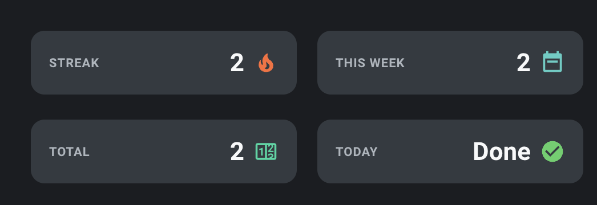
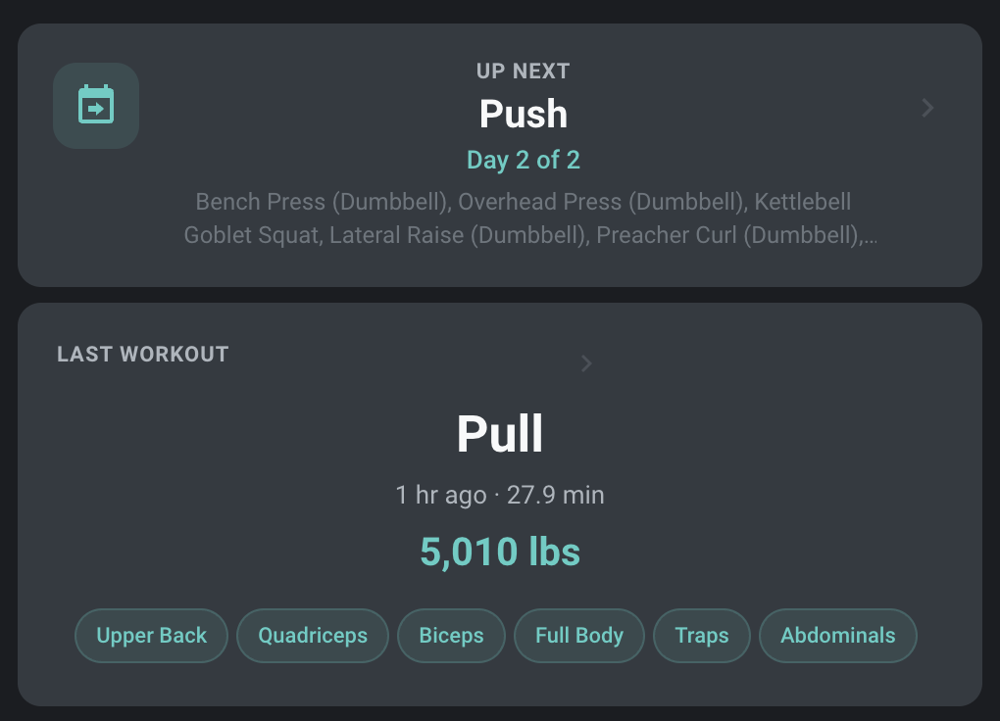
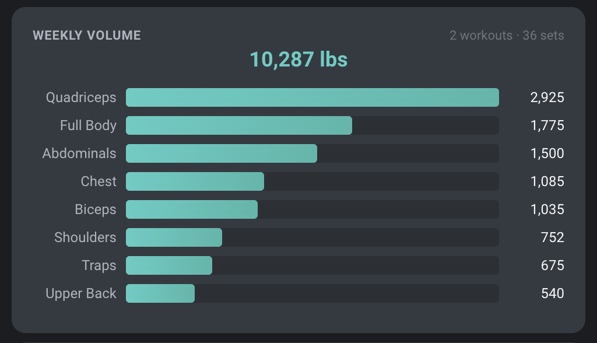
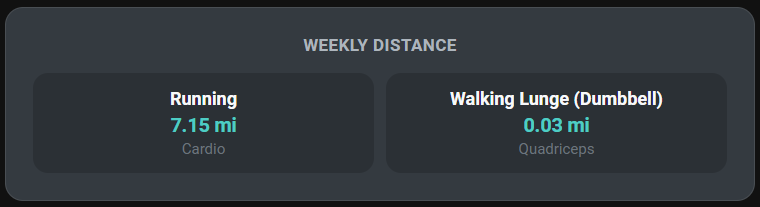
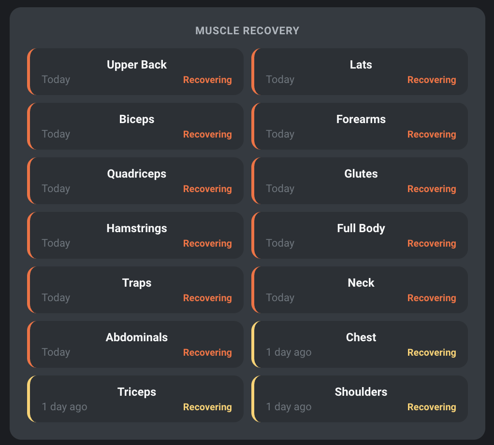
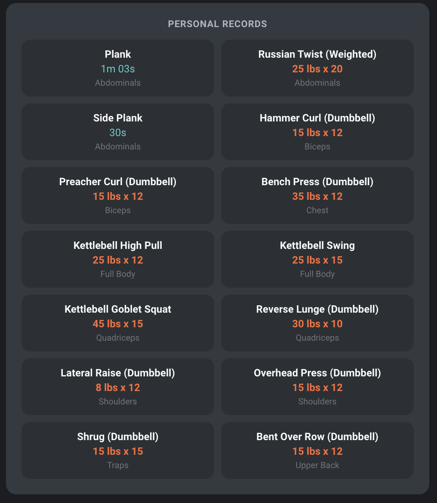
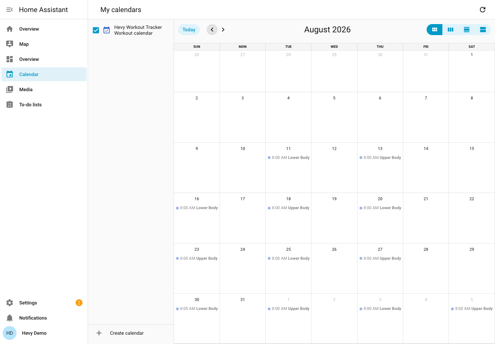

# Hevy Workout Tracker for Home Assistant

[](https://github.com/hacs/integration)
[](https://github.com/DisplacedForest/ha-hevy-tracker/releases)
[](https://github.com/DisplacedForest/ha-hevy-tracker/actions/workflows/ci.yml)
[](https://github.com/DisplacedForest/ha-hevy-tracker/stargazers)
[](https://github.com/DisplacedForest/ha-hevy-tracker/commits/main)
[](LICENSE)
[](https://www.home-assistant.io/)
[](https://buymeacoffee.com/o7triud67l)

A comprehensive Home Assistant integration for tracking your [Hevy](https://www.hevyapp.com/) workouts, with rich set-level sensor data, personal records, muscle recovery tracking, and dashboard-ready cards.

> **Note:** A [Hevy Pro](https://www.hevyapp.com/pro) subscription is required to access the Hevy API.

---

## Installation

### Via HACS (Recommended)

[](https://my.home-assistant.io/redirect/hacs_repository/?owner=DisplacedForest&repository=ha-hevy-tracker&category=integration)

1. Click the button above, or search for **Hevy Workout Tracker** in HACS
2. Click **Download**
3. Restart Home Assistant

### Manual Installation

1. Download the `hevy` folder from the [latest release](https://github.com/DisplacedForest/ha-hevy-tracker/releases/latest)
2. Copy it to your `custom_components` directory
3. Restart Home Assistant

---

## Configuration

1. Go to **Settings** → **Devices & Services** → **+ Add Integration**
2. Search for **Hevy Workout Tracker**
3. Enter your Hevy API key

### Getting Your API Key

1. Open the Hevy app → **Profile** → **Settings** → **Developer**
2. Copy your API key

### Options

Access via **Devices & Services** → **Hevy Workout Tracker** → **Configure**

| Option | Default | Description |
|--------|---------|-------------|
| Polling Interval | 15 min | How often to fetch new data (5–120 min) |
| Unit System | Imperial | Display weights in lbs or kg |

---

## Features

- **Rich Workout Data**: Full set-level detail with weight, reps, and duration tracking
- **Summary Sensors**: Workout count, streaks, and weekly activity at a glance
- **Per-Exercise Sensors**: Individual sensors for each exercise with personal records
- **Muscle Group Tracking**: Which muscles you hit, which are due, days since last trained
- **Weekly Volume Analysis**: Volume per muscle group with full exercise breakdown
- **Routine Rotation**: Automatically detects the next workout in your A/B/C rotation
- **30-Day History**: Service call for full workout history with enriched data
- **Live Workouts**: Bundled dashboard card with sessions saved in Home Assistant, routine selection, editable sets, and confirmed posting to Hevy
- **Workout Logging**: Service call that posts a completed workout back to Hevy, in your configured units
- **Automatic Updates**: Configurable polling interval (5–120 minutes)
- **Calendar Entity**: Completed workouts appear on the HA calendar with exercise details, volume, and duration. This is a history view (workouts are logged after the fact), not an automation trigger source
- **Unit Support**: Imperial (lbs) or metric (kg)

---

## Dashboard

The bundled live workout card and native calendar card work alongside your existing dashboard. The stats, recovery, and personal record examples use [`custom:button-card`](https://github.com/custom-cards/button-card) and [`custom:layout-card`](https://github.com/thomasloven/lovelace-layout-card), both available in HACS.

### Live workout card

The card is included with the integration and requires Home Assistant 2024.7 or later. After installing or updating to 1.5.1 and restarting Home Assistant:

1. Enable **Advanced mode** in your Home Assistant profile if Resources is hidden.
2. Open **Settings → Dashboards → Resources** and add `/hevy/hevy-workout-card.js?version=1.5.1` with resource type **JavaScript Module**.
3. Add a manual card to your dashboard:

```yaml
type: custom:hevy-workout-card
```

With one Hevy integration entry, the card selects it automatically. With several entries, use the account picker or set `config_entry_id` in the card configuration. Optional `routine_ids` and `exercise_ids` lists choose your favorites:

```yaml
type: custom:hevy-workout-card
config_entry_id: YOUR_CONFIG_ENTRY_ID
routine_ids:
  - YOUR_ROUTINE_ID
exercise_ids:
  - 79D0BB3A
```

Use `hevy.get_routines` and `hevy.get_exercise_catalog` in **Developer Tools → Actions** to find these IDs.

Start from a routine or build a workout with exercises from your catalog. Edit the sets and check each set as you complete it. **Finish** asks for confirmation and sends only checked sets to Hevy.

Home Assistant saves one active session per Hevy integration entry. Refreshing the tablet, reconnecting, or restarting Home Assistant reloads that session. A session keeps the unit system it started with. Changing the integration's unit option affects the next session.

The next-routine suggestion uses the integration's existing rotation data. Hevy's public workout creation API does not link new logs to a routine, so logging from the card does not automatically advance that rotation.

The card requires a connection to Home Assistant to save changes and does not accept offline edits. If a network interruption leaves the result of a finish request uncertain, check Hevy for the workout before choosing to retry or clear the session. Retrying a workout that already reached Hevy can create a duplicate.

### Customize your workout board

Open the card's visual editor to choose which controls appear. Every setting below is optional. The header is smaller and introductory text is hidden by default. Workout controls keep their existing defaults.

| Setting | Default | What it does |
|---------|---------|--------------|
| `title` | `Workout` | Sets the board heading. |
| `show_header` | `true` | Shows the board heading and session badge. The account label or picker stays visible when the header is hidden. |
| `show_intro` | `false` | Shows a short intro above the routine picker. |
| `intro_text` | `Choose a routine.` | Sets the intro text when `show_intro` is enabled. |
| `workout_title` | `editable` | Use `editable` for an input, `readonly` for plain text, or `hidden` to hide the session title. |
| `show_exercise_notes` | `true` | Shows exercise notes inputs. Hidden notes keep their saved values. |
| `show_add_exercise` | `true` | Shows the entire Add an exercise section. Existing exercises and their sets stay available. |
| `show_empty_workout` | `true` | Shows Empty workout in the routine picker. When hidden, an available routine is selected. Starting is disabled if there are no routines. |
| `show_remove_exercise` | `true` | Shows the Remove button next to each exercise. Set removal stays available. |
| `show_set_type` | `true` | Shows the set type dropdown. Hiding it preserves the routine or saved set type. |
| `show_rpe` | `true` | Shows the RPE dropdown. Hiding it preserves any saved RPE. |
| `show_private_workout` | `true` | Shows the Private workout checkbox. |
| `default_private_workout` | `false` | Makes new sessions public or private. Applies once when starting a workout. |
| `collapse_completed_sets` | `false` | Collapses checked sets into a measurement summary. Choose Show details to edit, or uncheck a set to undo completion. |
| `show_account_stats` | `false` | Shows total workouts, the last 7 days' workout count, and streak for the selected account. |

For a compact board with private workouts and account stats:

```yaml
type: custom:hevy-workout-card
show_header: false
workout_title: readonly
show_exercise_notes: false
show_add_exercise: false
show_empty_workout: false
show_remove_exercise: false
show_set_type: false
show_rpe: false
show_private_workout: false
default_private_workout: true
collapse_completed_sets: true
show_account_stats: true
```

Display settings belong to each card. Saved sessions keep their title, notes, privacy, set types, RPE, and completed sets when opened from another card with different display settings. Hiding a control does not erase its value. Invalid edits stay visible until corrected or the saved session is loaded. Hidden titles still use the routine title, or "Workout" for an empty workout. The finish confirmation always shows the account and actual workout privacy before sending.

Routines load when the Hevy integration starts. After adding or changing a routine in Hevy, reload that integration in Home Assistant to update the picker.

After a confirmed submission, the card returns to the routine picker with a short success message. Your selected account stays the same and its stats refresh. Start the next workout directly. The finished session stays saved until then, so there is no extra clear-session step. Pending and uncertain submissions stay on screen until their outcome is resolved.

### Shared tablets and multiple accounts

Add the integration once per person's Hevy account, using that person's API key. Each account needs Hevy API access, currently provided with Hevy Pro. Each entry has its own routines, stats, and saved workout. On a shared tablet, use **Who is working out?** to switch accounts. A separate Home Assistant login for every person is optional.

The picker uses the Hevy display name when available. Rename the integration entry in Home Assistant to give it your own label, especially when two accounts share a name. If the profile lookup is unavailable, the entry name still works. Profile names load when the integration starts; reload it to fetch a changed Hevy name. API keys stay in the integration and never belong in card configuration.

Set `config_entry_id` to choose the account a card opens on. With multiple entries, the picker remains available. Switching accounts saves pending edits first; invalid or unsaved edits must be resolved before switching. Account selection belongs to that card, so another screen can keep working with a different account.

Enable `show_account_stats` for stats that follow the picker. These use the integration's existing polling data and refresh after a confirmed workout submission. Unavailable data is labeled instead of displayed as zero. Standalone stats cards in the examples below still need the entity IDs for the intended account, including any IDs inside their templates. They do not follow this card's account picker.

Account selection is for choosing the workout destination. It does not restrict which Home Assistant users can access an account. The Private workout setting controls the workout's visibility in Hevy. Local profiles cannot divide one Hevy account into separate people's histories.

### Dashboard examples

<details>
<summary><b>Hero Stats Grid</b></summary>



```yaml
type: custom:layout-card
layout_type: custom:grid-layout
layout:
  grid-template-columns: 1fr 1fr
  grid-gap: 10px
  margin: 0
cards:
  # Streak
  - type: custom:button-card
    entity: sensor.hevy_workout_tracker_current_streak
    show_name: false
    show_state: false
    show_icon: false
    show_label: false
    tap_action:
      action: none
    custom_fields:
      stat: |
        [[[
          return '<div style="display:flex;align-items:center;justify-content:space-between;width:100%;">' +
            '<div style="color:#ADB5BD;font-size:11px;font-weight:600;text-transform:uppercase;letter-spacing:0.5px;">Streak</div>' +
            '<div style="display:flex;align-items:center;gap:8px;">' +
              '<span style="color:#F8F9FA;font-size:22px;font-weight:700;">' + (entity.state || '0') + '</span>' +
              '<ha-icon icon="mdi:fire" style="--mdc-icon-size:22px;color:#FF6B35;"></ha-icon>' +
            '</div>' +
          '</div>';
        ]]]
    styles:
      card:
        - background: "#343A40"
        - border-radius: 12px
        - padding: 16px
        - height: 56px
      grid:
        - grid-template-areas: '"stat"'
        - grid-template-columns: 1fr
      custom_fields:
        stat:
          - display: flex
          - align-items: center
          - width: 100%
  # This Week
  - type: custom:button-card
    entity: sensor.hevy_workout_tracker_weekly_workout_count
    show_name: false
    show_state: false
    show_icon: false
    show_label: false
    tap_action:
      action: none
    custom_fields:
      stat: |
        [[[
          return '<div style="display:flex;align-items:center;justify-content:space-between;width:100%;">' +
            '<div style="color:#ADB5BD;font-size:11px;font-weight:600;text-transform:uppercase;letter-spacing:0.5px;">This Week</div>' +
            '<div style="display:flex;align-items:center;gap:8px;">' +
              '<span style="color:#F8F9FA;font-size:22px;font-weight:700;">' + (entity.state || '0') + '</span>' +
              '<ha-icon icon="mdi:calendar-week" style="--mdc-icon-size:22px;color:#4ECDC4;"></ha-icon>' +
            '</div>' +
          '</div>';
        ]]]
    styles:
      card:
        - background: "#343A40"
        - border-radius: 12px
        - padding: 16px
        - height: 56px
      grid:
        - grid-template-areas: '"stat"'
        - grid-template-columns: 1fr
      custom_fields:
        stat:
          - display: flex
          - align-items: center
          - width: 100%
  # Total
  - type: custom:button-card
    entity: sensor.hevy_workout_tracker_workout_count
    show_name: false
    show_state: false
    show_icon: false
    show_label: false
    tap_action:
      action: none
    custom_fields:
      stat: |
        [[[
          return '<div style="display:flex;align-items:center;justify-content:space-between;width:100%;">' +
            '<div style="color:#ADB5BD;font-size:11px;font-weight:600;text-transform:uppercase;letter-spacing:0.5px;">Total</div>' +
            '<div style="display:flex;align-items:center;gap:8px;">' +
              '<span style="color:#F8F9FA;font-size:22px;font-weight:700;">' + (entity.state || '0') + '</span>' +
              '<ha-icon icon="mdi:counter" style="--mdc-icon-size:22px;color:#06D6A0;"></ha-icon>' +
            '</div>' +
          '</div>';
        ]]]
    styles:
      card:
        - background: "#343A40"
        - border-radius: 12px
        - padding: 16px
        - height: 56px
      grid:
        - grid-template-areas: '"stat"'
        - grid-template-columns: 1fr
      custom_fields:
        stat:
          - display: flex
          - align-items: center
          - width: 100%
  # Today
  - type: custom:button-card
    entity: sensor.hevy_workout_tracker_worked_out_today
    show_name: false
    show_state: false
    show_icon: false
    show_label: false
    tap_action:
      action: none
    custom_fields:
      stat: |
        [[[
          var done = entity.state == 'on';
          var iconColor = done ? '#51CF66' : '#495057';
          var label = done ? 'Done' : 'Not yet';
          return '<div style="display:flex;align-items:center;justify-content:space-between;width:100%;">' +
            '<div style="color:#ADB5BD;font-size:11px;font-weight:600;text-transform:uppercase;letter-spacing:0.5px;">Today</div>' +
            '<div style="display:flex;align-items:center;gap:8px;">' +
              '<span style="color:#F8F9FA;font-size:22px;font-weight:700;">' + label + '</span>' +
              '<ha-icon icon="mdi:check-circle" style="--mdc-icon-size:22px;color:' + iconColor + ';"></ha-icon>' +
            '</div>' +
          '</div>';
        ]]]
    styles:
      card:
        - background: "#343A40"
        - border-radius: 12px
        - padding: 16px
        - height: 56px
      grid:
        - grid-template-areas: '"stat"'
        - grid-template-columns: 1fr
      custom_fields:
        stat:
          - display: flex
          - align-items: center
          - width: 100%
```

</details>

<details>
<summary><b>Last Workout Card</b></summary>



```yaml
type: custom:button-card
entity: sensor.hevy_workout_tracker_last_workout_summary
show_name: false
show_state: false
show_icon: false
show_label: false
tap_action:
  action: none
custom_fields:
  content: |
    [[[
      var title = entity.state || 'No workouts';
      var dateStr = entity.attributes.date;
      var mins = entity.attributes.duration_minutes;
      var vol = entity.attributes.total_volume;
      var unit = entity.attributes.total_volume_unit || 'lbs';
      var timeAgo = '';
      if (dateStr) {
        var date = new Date(dateStr);
        var now = new Date();
        var diff = Math.floor((now - date) / 1000);
        if (diff < 60) timeAgo = 'Just now';
        else if (diff < 3600) { var m = Math.floor(diff / 60); timeAgo = m + (m === 1 ? ' min ago' : ' mins ago'); }
        else if (diff < 86400) { var h = Math.floor(diff / 3600); timeAgo = h + (h === 1 ? ' hr ago' : ' hrs ago'); }
        else if (diff < 172800) timeAgo = 'Yesterday';
        else { var d = Math.floor(diff / 86400); timeAgo = d + 'd ago'; }
      }
      var meta = timeAgo + (mins ? ' · ' + mins + ' min' : '');
      var volStr = vol ? Math.round(vol).toLocaleString() + ' ' + unit : '';

      var muscleEntity = states['sensor.hevy_workout_tracker_muscle_group_summary'];
      var groups = (muscleEntity && muscleEntity.attributes) ? muscleEntity.attributes.last_workout_primary_groups || [] : [];
      var pills = '';
      groups.forEach(function(g) {
        var name = g.split('_').map(function(w){ return w.charAt(0).toUpperCase() + w.slice(1); }).join(' ');
        pills += '<span style="display:inline-block;background:rgba(78,205,196,0.1);border:1px solid rgba(78,205,196,0.2);border-radius:20px;padding:2px 10px;margin:2px 4px 2px 0;font-size:11px;color:#4ECDC4;font-weight:500;">' + name + '</span>';
      });

      return '<div>' +
        '<div style="display:flex;align-items:flex-start;justify-content:space-between;margin-bottom:12px;">' +
          '<div style="color:#ADB5BD;font-size:11px;font-weight:600;text-transform:uppercase;letter-spacing:0.5px;">LAST WORKOUT</div>' +
        '</div>' +
        '<div style="color:#F8F9FA;font-size:26px;font-weight:700;margin-bottom:8px;">' + title + '</div>' +
        '<div style="color:#ADB5BD;font-size:13px;margin-bottom:10px;">' + meta + '</div>' +
        (volStr ? '<div style="color:#4ECDC4;font-size:20px;font-weight:700;margin-bottom:12px;">' + volStr + '</div>' : '') +
        (pills ? '<div style="line-height:2;">' + pills + '</div>' : '') +
      '</div>';
    ]]]
styles:
  card:
    - background: "#343A40"
    - border-radius: 12px
    - padding: 20px
    - margin-top: 8px
  grid:
    - grid-template-areas: '"content"'
    - grid-template-columns: 1fr
  custom_fields:
    content:
      - white-space: normal
```

</details>

<details>
<summary><b>Weekly Volume Bar Chart</b></summary>



```yaml
type: custom:button-card
entity: sensor.hevy_workout_tracker_weekly_muscle_volume
show_name: false
show_state: false
show_icon: false
show_label: false
tap_action:
  action: none
custom_fields:
  vol: |
    [[[
      return (function() {
        var groups = entity.attributes.muscle_groups || {};
        var totalVol = parseFloat(entity.state) || 0;
        var totalSets = entity.attributes.total_sets || 0;
        var totalWorkouts = entity.attributes.total_workouts || 0;
        var fmt = function(n) { return n.split('_').map(function(w){ return w.charAt(0).toUpperCase() + w.slice(1); }).join(' '); };
        var h = '<div>';
        h += '<div style="display:flex;align-items:center;justify-content:space-between;margin-bottom:4px;">';
        h += '<div style="color:#ADB5BD;font-size:11px;font-weight:600;text-transform:uppercase;letter-spacing:0.5px;">Weekly Volume</div>';
        h += '<div style="color:#6C757D;font-size:11px;">' + totalWorkouts + ' workouts · ' + totalSets + ' sets</div>';
        h += '</div>';
        h += '<div style="color:#4ECDC4;font-size:18px;font-weight:700;margin-bottom:14px;">' + Math.round(totalVol).toLocaleString() + ' lbs</div>';
        var sorted = Object.entries(groups).sort(function(a,b) { return b[1] - a[1]; });
        if (!sorted.length) {
          h += '<div style="color:#6C757D;font-size:13px;">No data this week</div>';
          h += '</div>';
          return h;
        }
        var maxVol = sorted[0][1];
        sorted.forEach(function(pair) {
          var name = pair[0]; var vl = pair[1];
          var pct = maxVol > 0 ? (vl / maxVol * 100) : 0;
          var label = fmt(name);
          h += '<div style="display:flex;align-items:center;margin-bottom:8px;gap:8px;">';
          h += '<div style="width:72px;flex-shrink:0;color:#ADB5BD;font-size:12px;text-align:right;">' + label + '</div>';
          h += '<div style="flex:1;height:16px;background:#2B3035;border-radius:3px;overflow:hidden;">';
          h += '<div style="width:' + pct + '%;height:100%;background:linear-gradient(90deg,#4ECDC4,#45B7AA);border-radius:3px;"></div>';
          h += '</div>';
          h += '<div style="width:48px;flex-shrink:0;color:#F8F9FA;font-size:12px;text-align:right;">' + Math.round(vl).toLocaleString() + '</div>';
          h += '</div>';
        });
        h += '</div>';
        return h;
      })();
    ]]]
styles:
  card:
    - background: "#343A40"
    - border-radius: 12px
    - padding: 18px
    - margin-top: 8px
  grid:
    - grid-template-areas: '"vol"'
    - grid-template-columns: 1fr
  custom_fields:
    vol:
      - white-space: normal
```

</details>

<details>
<summary><b>Weekly Distance Grid</b></summary>



```yaml
type: custom:button-card
entity: sensor.hevy_workout_tracker_workout_count
show_name: false
show_state: false
show_icon: false
show_label: false
tap_action:
  action: none
custom_fields:
  prs: |
    [[[
      return (function() {
        var exercises = Object.keys(states).filter(function(e) {
          return e.startsWith('sensor.hevy_workout_tracker_') &&
                 states[e].attributes.weekly_distance !== undefined ;
        });
        var fmt = function(n) { return n.split('_').map(function(w){ return w.charAt(0).toUpperCase() + w.slice(1); }).join(' '); };
        var h = '<div>';
        h += '<div style="color:#ADB5BD;font-size:11px;font-weight:600;text-transform:uppercase;letter-spacing:0.5px;margin-bottom:12px;">Weekly Distance</div>';
        if (!exercises.length) {
          h += '<div style="color:#6C757D;font-size:13px;">No PR data yet</div></div>';
          return h;
        }
        h += '<div style="display:grid;grid-template-columns:1fr 1fr;gap:8px;">';
        exercises.sort(function(a, b) {
          var ga = (states[a].attributes.muscle_group || 'zzz');
          var gb = (states[b].attributes.muscle_group || 'zzz');
          return ga.localeCompare(gb);
        });
        exercises.forEach(function(eid) {
          var s = states[eid];
          var name = s.attributes.friendly_name || eid;
          name = name.replace('Hevy Workout Tracker ', '');
          var prD = s.attributes.weekly_distance;
          var unitD = s.attributes.distance_unit || 'mi';
          var group = s.attributes.muscle_group || '';
          var groupLabel = group ? fmt(group) : '';
          var prStr = '';
          prStr = prD + ' ' + unitD;
          h += '<div style="background:#2B3035;border-radius:10px;padding:10px 12px;text-align:center;">';
          h += '<div style="color:#F8F9FA;font-size:12px;font-weight:600;margin-bottom:2px;">' + name + '</div>';
          h += '<div style="color:#4ECDC4;font-size:13px;font-weight:700;margin-bottom:2px;">' + prStr + '</div>';
          if (groupLabel) h += '<div style="color:#6C757D;font-size:10px;">' + groupLabel + '</div>';
          h += '</div>';
        });
        h += '</div></div>';
        return h;
      })();
    ]]]
styles:
  card:
    - background: "#343A40"
    - border-radius: 12px
    - padding: 18px
    - margin-top: 8px
  grid:
    - grid-template-areas: "\"prs\""
    - grid-template-columns: 1fr
  custom_fields:
    prs:
      - white-space: normal
```

</details>


<details>
<summary><b>Muscle Recovery Grid</b></summary>



```yaml
type: custom:button-card
entity: sensor.hevy_workout_tracker_muscle_group_summary
show_name: false
show_state: false
show_icon: false
show_label: false
tap_action:
  action: none
custom_fields:
  rec: |
    [[[
      return (function() {
        var daysSince = entity.attributes.days_since_last || {};
        var musclesDue = entity.attributes.muscles_due || [];
        var dueSet = {};
        musclesDue.forEach(function(m) { dueSet[m] = true; });
        var fmt = function(n) { return n.split('_').map(function(w){ return w.charAt(0).toUpperCase() + w.slice(1); }).join(' '); };
        var h = '<div>';
        h += '<div style="color:#ADB5BD;font-size:11px;font-weight:600;text-transform:uppercase;letter-spacing:0.5px;margin-bottom:12px;">Muscle Recovery</div>';
        var sorted = Object.entries(daysSince).sort(function(a,b) { return a[1] - b[1]; });
        if (!sorted.length) {
          h += '<div style="color:#6C757D;font-size:13px;">No data yet</div></div>';
          return h;
        }
        h += '<div style="display:grid;grid-template-columns:1fr 1fr;gap:8px;">';
        sorted.forEach(function(pair) {
          var name = pair[0]; var days = pair[1];
          var color, label;
          if (days === 0) { color = '#FF6B35'; label = 'Recovering'; }
          else if (days === 1) { color = '#FFD166'; label = 'Recovering'; }
          else if (days <= 3) { color = '#06D6A0'; label = 'Ready'; }
          else if (days <= 5) { color = '#4ECDC4'; label = 'Train Soon'; }
          else { color = '#ADB5BD'; label = 'Overdue'; }
          var displayName = fmt(name);
          var timeLabel = days === 0 ? 'Today' : days === 1 ? '1 day ago' : days + ' days ago';
          var isDue = dueSet[name] === true;
          var glow = isDue ? 'box-shadow:0 0 8px ' + color + '33;' : '';
          h += '<div style="background:#2B3035;border-radius:10px;padding:10px 12px;border-left:3px solid ' + color + ';' + glow + '">';
          h += '<div style="color:#F8F9FA;font-size:12px;font-weight:600;margin-bottom:2px;">' + displayName + '</div>';
          h += '<div style="display:flex;justify-content:space-between;align-items:center;">';
          h += '<span style="color:#6C757D;font-size:11px;">' + timeLabel + '</span>';
          h += '<span style="color:' + color + ';font-size:10px;font-weight:600;">' + label + '</span>';
          h += '</div></div>';
        });
        h += '</div></div>';
        return h;
      })();
    ]]]
styles:
  card:
    - background: "#343A40"
    - border-radius: 12px
    - padding: 18px
    - margin-top: 8px
  grid:
    - grid-template-areas: '"rec"'
    - grid-template-columns: 1fr
  custom_fields:
    rec:
      - white-space: normal
```

</details>

<details>
<summary><b>Personal Records Grid</b></summary>



```yaml
type: custom:button-card
entity: sensor.hevy_workout_tracker_workout_count
show_name: false
show_state: false
show_icon: false
show_label: false
tap_action:
  action: none
custom_fields:
  prs: |
    [[[
      return (function() {
        var exercises = Object.keys(states).filter(function(e) {
          return e.startsWith('sensor.hevy_workout_tracker_') &&
                 (states[e].attributes.personal_record_weight !== undefined ||
                  states[e].attributes.personal_record_distance !== undefined
                 );
        });
        var fmt = function(n) { return n.split('_').map(function(w){ return w.charAt(0).toUpperCase() + w.slice(1); }).join(' '); };
        var h = '<div>';
        h += '<div style="color:#ADB5BD;font-size:11px;font-weight:600;text-transform:uppercase;letter-spacing:0.5px;margin-bottom:12px;">Personal Records</div>';
        if (!exercises.length) {
          h += '<div style="color:#6C757D;font-size:13px;">No PR data yet</div></div>';
          return h;
        }
        h += '<div style="display:grid;grid-template-columns:1fr 1fr;gap:8px;">';
        exercises.sort(function(a, b) {
          var ga = (states[a].attributes.muscle_group || 'zzz');
          var gb = (states[b].attributes.muscle_group || 'zzz');
          return ga.localeCompare(gb);
        });
        exercises.forEach(function(eid) {
          var s = states[eid];
          var name = s.attributes.friendly_name || eid;
          name = name.replace('Hevy Workout Tracker ', '');
          var prW = s.attributes.personal_record_weight;
          var prR = s.attributes.personal_record_reps;
          var unitW = s.attributes.weight_unit || 'lbs';
          var prD = s.attributes.personal_record_distance;
          var unitD = s.attributes.distance_unit || 'mi';
          var group = s.attributes.muscle_group || '';
          var groupLabel = group ? fmt(group) : '';
          var prStr = '';
          if (prW != null && prR != null) prStr = prW + ' ' + unitW + ' x ' + prR;
          else if (prW != null) prStr = prW + ' ' + unitW;
          else if (prD != null) prStr = prD + ' ' + unitD;
          else return;
          h += '<div style="background:#2B3035;border-radius:10px;padding:10px 12px;text-align:center;">';
          h += '<div style="color:#F8F9FA;font-size:12px;font-weight:600;margin-bottom:2px;">' + name + '</div>';
          h += '<div style="color:#4ECDC4;font-size:13px;font-weight:700;margin-bottom:2px;">' + prStr + '</div>';
          if (groupLabel) h += '<div style="color:#6C757D;font-size:10px;">' + groupLabel + '</div>';
          h += '</div>';
        });
        h += '</div></div>';
        return h;
      })();
    ]]]
styles:
  card:
    - background: "#343A40"
    - border-radius: 12px
    - padding: 18px
    - margin-top: 8px
  grid:
    - grid-template-areas: '"prs"'
    - grid-template-columns: 1fr
  custom_fields:
    prs:
      - white-space: normal
```

</details>

<details>
<summary><b>Workout Calendar</b></summary>

Use Home Assistant's built-in Calendar card to see completed workouts. Add a Calendar card from the dashboard editor and select the Hevy **Workout calendar** entity, or use YAML:

```yaml
type: calendar
entities:
  - calendar.hevy_workout_tracker_workout_calendar
initial_view: dayGridMonth
```



The screenshot uses example workout data in a local Home Assistant instance.

Your entity ID may differ if you renamed the integration or have more than one Hevy account. Find the actual calendar entity under **Settings → Devices & Services → Hevy Workout Tracker → Entities**.

Select a workout to see its start and end time, exercises, set counts, and weighted volume in your configured units. The calendar uses the integration's cached 30-day workout history and refreshes with its polling interval. Multiple workouts on the same day appear as separate events.

This calendar shows completed workouts. It does not schedule future workouts or provide workout-start automation triggers. Dates outside the cached history can be empty even when older workouts exist in Hevy.

</details>

---

## Sensors

### Summary Sensors

| Sensor | Description | State |
|--------|-------------|-------|
| `sensor.hevy_workout_count` | Total lifetime workouts | Integer |
| `sensor.hevy_last_workout_date` | Timestamp of most recent workout | ISO datetime |
| `sensor.hevy_last_workout_summary` | Full summary of last workout | Workout title |
| `sensor.hevy_weekly_workout_count` | Workouts completed in last 7 days | Integer |
| `sensor.hevy_current_streak` | Consecutive workout days (1 rest day allowed) | Days |
| `sensor.hevy_muscle_group_summary` | Muscle groups trained in last workout | Comma-separated |
| `sensor.hevy_weekly_muscle_volume` | Total weekly volume across all groups | Volume (lbs or kg) |
| `sensor.hevy_next_workout` | Next routine in your A/B/C rotation | Routine title |

### Binary Sensors

| Sensor | Description |
|--------|-------------|
| `binary_sensor.hevy_worked_out_today` | `on` if a workout was logged today |
| `binary_sensor.hevy_worked_out_this_week` | `on` if any workout in last 7 days |

### Per-Exercise Sensors

Dynamically created for each unique exercise in your history.

**Example:** `sensor.hevy_bench_press_dumbbell`
**State:** Best set, e.g. `35 lbs × 12` or `60s`

| Attribute | Description |
|-----------|-------------|
| `last_workout_date` | ISO datetime of last time this exercise was performed |
| `last_workout_sets` | List of all sets from last workout |
| `weight` | Most recent weight used |
| `weight_unit` | Unit system (lbs or kg) |
| `total_reps` | Total reps from last workout |
| `total_sets` | Number of sets performed |
| `personal_record_weight` | Heaviest weight ever used |
| `personal_record_reps` | Most reps at PR weight |
| `exercise_template_id` | Hevy exercise ID |

---

## Services

### `hevy.get_workout_history`

Returns enriched workout history for a specified number of days. Call via **Developer Tools → Services**.

| Parameter | Required | Default | Description |
|-----------|----------|---------|-------------|
| `config_entry_id` | Yes | none | The Hevy integration config entry ID |
| `days` | No | 30 | Number of days of history (1–90) |

**Response includes:**
- `summary`: Total workouts, total volume, workout days, avg duration, avg volume per workout
- `workouts`: Array of workouts with full exercise/set detail, muscle groups, and duration

<details>
<summary><b>Example automation using service response</b></summary>

```yaml
action:
  - service: hevy.get_workout_history
    data:
      config_entry_id: !input config_entry
      days: 7
    response_variable: history
  - service: notify.mobile_app
    data:
      message: "This week: {{ history.summary.total_workouts }} workouts, {{ history.summary.total_volume }} lbs total volume"
```

</details>

### `hevy.get_exercise_catalog`

Returns the cached Hevy exercise catalog, sorted by title. Use it to find the exact names `hevy.log_workout` expects.

| Parameter | Required | Default | Description |
|-----------|----------|---------|-------------|
| `config_entry_id` | Yes | none | The Hevy integration config entry ID |

**Response includes:**
- `count`: Number of exercises in the catalog
- `exercises`: Array of `{ id, title, muscle_group }`

<details>
<summary><b>Example call and response</b></summary>

```yaml
action:
  - service: hevy.get_exercise_catalog
    data:
      config_entry_id: YOUR_CONFIG_ENTRY_ID
    response_variable: catalog
```

```yaml
count: 412
exercises:
  - id: 79D0BB3A
    title: Bench Press (Barbell)
    muscle_group: chest
  - id: 0393F233
    title: Bicep Curl (Dumbbell)
    muscle_group: biceps
```

</details>

### `hevy.get_routines`

Returns your saved Hevy routines with every exercise and set. Weights and distances come back in the unit system configured for the integration, so a routine's sets can be handed straight to `hevy.log_workout`.

| Parameter | Required | Default | Description |
|-----------|----------|---------|-------------|
| `config_entry_id` | Yes | none | The Hevy integration config entry ID |

**Response includes:**
- `count`: Number of routines
- `routines`: Array of `{ id, title, exercises }`, where each exercise has a `name`, an `exercise_template_id`, and a list of sets. A set always has a `type`, plus whichever of `weight`, `reps`, `duration_seconds`, and `distance` the routine defines.

<details>
<summary><b>Example call and response</b></summary>

```yaml
action:
  - service: hevy.get_routines
    data:
      config_entry_id: YOUR_CONFIG_ENTRY_ID
    response_variable: routines
```

```yaml
count: 2
routines:
  - id: r-8f21
    title: Push Day
    exercises:
      - name: Bench Press
        exercise_template_id: 79D0BB3A
        sets:
          - type: warmup
            weight: 135
            reps: 8
          - type: normal
            weight: 225
            reps: 5
      - name: Running
        exercise_template_id: AC1BB830
        sets:
          - type: normal
            duration_seconds: 1500
            distance: 3.1
```

</details>

### `hevy.log_workout`

Posts a completed workout to Hevy. Exercise names are matched against your Hevy exercise catalog (exact first, then case-insensitive), and weights and distances are sent in the unit system configured for the integration. If any exercise name cannot be matched, nothing is posted and the error lists the closest names.

> **Warning:** The Hevy API has no delete, and the web app doesn't either. A mistakenly logged workout can only be removed in the Hevy mobile app, so give any dashboard button that calls this service a confirmation step.

| Parameter | Required | Default | Description |
|-----------|----------|---------|-------------|
| `config_entry_id` | Yes | none | The Hevy integration config entry ID |
| `title` | Yes | none | Name of the workout |
| `exercises` | Yes | none | List of exercises, each with a `name`, optional `notes`, and one or more `sets` |
| `start_time` | No | End time minus duration | When the workout started |
| `end_time` | No | Now | When the workout ended |
| `duration_minutes` | No | none | Workout length, used to derive the start time |
| `description` | No | none | Workout notes |
| `is_private` | No | false | Hide the workout from your Hevy followers |

Each set takes an optional `type` (`warmup`, `normal`, `failure`, `dropset`, defaulting to `normal`), an optional `rpe` (6, 7, 7.5, 8, 8.5, 9, 9.5, 10), and at least one of `weight`, `reps`, `duration_seconds`, or `distance`.

**Response includes:**
- `workout_id`: The ID Hevy assigned to the new workout
- `title`: The title Hevy stored

<details>
<summary><b>Example script logging a workout from a dashboard button</b></summary>

```yaml
script:
  log_quick_push:
    alias: "Log Quick Push Workout"
    sequence:
      - service: hevy.log_workout
        data:
          config_entry_id: YOUR_CONFIG_ENTRY_ID
          title: "Quick Push"
          duration_minutes: 40
          exercises:
            - name: "Bench Press"
              notes: "Felt strong"
              sets:
                - type: warmup
                  weight: 135
                  reps: 8
                - weight: 225
                  reps: 5
                  rpe: 9
            - name: "Triceps Pushdown"
              sets:
                - weight: 60
                  reps: 12
        response_variable: logged
      - service: notify.mobile_app
        data:
          message: "Logged {{ logged.title }} to Hevy"
```

Add it to a dashboard with a button card:

```yaml
type: button
name: Log Quick Push
icon: mdi:dumbbell
tap_action:
  action: call-service
  service: script.log_quick_push
```

</details>

---

## Automation Examples

<details>
<summary><b>Workout streak milestone</b></summary>

```yaml
automation:
  - alias: "Workout Streak Milestone"
    trigger:
      - platform: numeric_state
        entity_id: sensor.hevy_current_streak
        above: 7
    action:
      - service: notify.mobile_app
        data:
          message: "7 day workout streak! Keep it up!"
```

</details>

<details>
<summary><b>Rest day reminder</b></summary>

```yaml
automation:
  - alias: "Rest Day Reminder"
    trigger:
      - platform: time
        at: "18:00:00"
    condition:
      - condition: state
        entity_id: binary_sensor.hevy_worked_out_today
        state: "off"
      - condition: numeric_state
        entity_id: sensor.hevy_current_streak
        above: 0
    action:
      - service: notify.mobile_app
        data:
          message: "Don't break your streak! Time for a workout."
```

</details>

<details>
<summary><b>Personal record alert</b></summary>

```yaml
automation:
  - alias: "New PR Notification"
    trigger:
      - platform: state
        entity_id: sensor.hevy_bench_press_dumbbell
        attribute: personal_record_weight
    condition:
      - condition: template
        value_template: "{{ trigger.to_state.attributes.personal_record_weight > trigger.from_state.attributes.personal_record_weight }}"
    action:
      - service: notify.mobile_app
        data:
          message: "New PR on Bench Press: {{ trigger.to_state.attributes.personal_record_weight }} {{ trigger.to_state.attributes.weight_unit }}!"
```

</details>

---

## Sensor Attribute Reference

<details>
<summary><b>Muscle Group Summary attributes</b></summary>

```yaml
last_workout_primary_groups:
  - chest
  - shoulders
  - quadriceps
  - biceps
last_workout_secondary_groups:
  - triceps
  - glutes
  - hamstrings
last_workout_date: "2026-02-11T16:21:10+00:00"
days_since_last:
  chest: 0
  shoulders: 0
  quadriceps: 0
  lats: 2
  hamstrings: 4
muscles_due:
  - hamstrings
  - glutes
```

</details>

<details>
<summary><b>Weekly Muscle Volume attributes</b></summary>

```yaml
period_start: "2026-02-04T16:00:00"
period_end: "2026-02-11T16:00:00"
muscle_groups:
  chest: 1860.0
  shoulders: 960.0
  quadriceps: 2025.0
exercise_breakdown:
  chest:
    - exercise: "Bench Press (Dumbbell)"
      volume: 1860.0
      sets: 3
  shoulders:
    - exercise: "Overhead Press (Dumbbell)"
      volume: 960.0
      sets: 3
total_sets: 45
total_workouts: 5
```

</details>

<details>
<summary><b>Next Workout attributes</b></summary>

```yaml
routine_id: "uuid-of-next-routine"
routine_title: "Day B - Pull/Hinge Focus"
last_workout_title: "Day A - Push/Quad Focus"
last_workout_routine_id: "uuid-of-last-routine"
rotation_position: 2
rotation_total: 3
exercises_preview:
  - "Barbell Row"
  - "Romanian Deadlift"
  - "Pull-up"
  - "Face Pull"
```

</details>

<details>
<summary><b>Last Workout Date: <code>workout_summaries</code> attribute</b></summary>

The `workout_summaries` attribute on `sensor.hevy_last_workout_date` provides a date-keyed dict of the last 30 days of workouts, useful for powering calendar cards.

```yaml
workout_summaries:
  "2026-02-10":
    title: "Push Day"
    duration_minutes: 62.5
    total_volume: 12450
    total_volume_unit: "lbs"
    exercise_count: 5
    exercises:
      - name: "Bench Press (Barbell)"
        sets:
          - type: "normal"
            weight: 185.0
            weight_unit: "lbs"
            reps: 5
        best_set: "185.0 lbs × 5"
        total_reps: 25
        notes: null
```

If multiple workouts fall on the same date, only the most recent is included.

</details>

---

## Troubleshooting

**Integration not showing up after install**
- Restart Home Assistant after installation
- Check logs: **Settings → System → Logs**

**Invalid API key error**
- Verify your key in the Hevy app under **Settings → Developer**
- Try regenerating the key

**Sensors not updating**
- Check your polling interval in the integration options
- Review HA logs for API errors

**Missing exercise sensors**
- Sensors are created dynamically on first data fetch
- Wait one polling cycle after logging a new exercise type

---

## Development

See [CONTRIBUTING.md](CONTRIBUTING.md) for setup and verification commands, and [DEVELOPMENT.md](DEVELOPMENT.md) for testing in Home Assistant.

## Support

- [Open an issue](https://github.com/DisplacedForest/ha-hevy-tracker/issues) for bug reports or feature requests
- [Home Assistant Community](https://community.home-assistant.io/) for general discussion

---

## License

MIT. See [LICENSE](LICENSE) for details.
